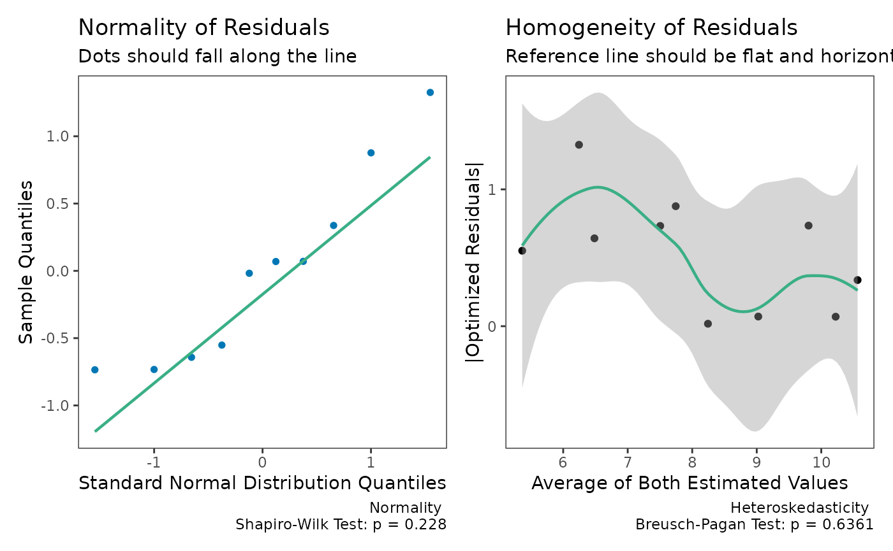

# Deming Regression

## Background

Error-in-variables (EIV) models are useful tools to account for
measurement error in the independent variable. For studies of agreement,
this is particularly useful where there are paired measurements of the
paired measurements (X & Y) of the same underlying value (e.g., two
assays of the same analyte).

Deming regression is one of the simplest forms of of EIV models promoted
by [W. Edwards
Deming](https://en.wikipedia.org/wiki/W._Edwards_Deming)[¹](#fn1). The
first to detail the method were Adcock ([1878](#ref-adcock1878))
followed by Kummell ([1879](#ref-kummell1879)) and Koopmans
([1936](#ref-koopmans1936)). The name comes from the popularity of
Deming’s book ([Deming 1943](#ref-deming1943)), and within the field of
clinical chemistry, the procedure was simply referred to as “Deming
regression” (e.g., Linnet ([1990](#ref-linnet1990))).

## Joint Confidence Regions

A key enhancement to the `dem_reg` function is the addition of **joint
confidence regions** for the slope and intercept parameters. Traditional
confidence intervals treat each parameter separately, but in regression
analysis, these parameters are correlated.

Joint confidence regions account for this correlation by creating an
elliptical region in the (intercept, slope) parameter space. This
approach, promoted by Sadler ([2010](#ref-sadler2010)), provides several
advantages:

1.  **Higher Statistical Power**: The ellipse typically requires 20-50%
    fewer samples than traditional confidence intervals to detect the
    same bias
2.  **Accounts for Parameter Correlation**: When the measurement range
    is narrow, slope and intercept are highly negatively correlated
3.  **More Appropriate Test**: Testing against a point (e.g., slope=1,
    intercept=0) is naturally done with a region, not separate intervals

The power advantage is most pronounced when the ratio of maximum to
minimum X values is small (\< 10:1), which is common in clinical method
comparisons.

## Basic Deming Regression

### Simple Deming Regression

We can start by creating some fake data to work with.

``` r
library(SimplyAgree)

dat = data.frame(
  x = c(7, 8.3, 10.5, 9, 5.1, 8.2, 10.2, 10.3, 7.1, 5.9),
  y = c(7.9, 8.2, 9.6, 9, 6.5, 7.3, 10.2, 10.6, 6.3, 5.2)
)
```

Also, we will assume, based on historical data, that the measurement
error ratio is equal to 4.

The data can be run through the `dem_reg` function and the results
printed. Note that the output now includes a joint confidence region
test.

``` r
dem1 = dem_reg(x = "x",
               y = "y",
               data = dat,
               error.ratio = 4,
               weighted = FALSE)
dem1
#> Deming Regression with 95% C.I.
#> 
#> Coefficients:
#>               coef      bias     se df lower.ci upper.ci        t p.value
#> Intercept -0.08974 -0.044938 1.7220  8  -4.0607    3.881 -0.05212  0.9597
#> Slope      1.00119  0.003529 0.1872  8   0.5696    1.433  0.00638  0.9951
#> 
#> Joint Confidence Region Test (H0: slope=1, intercept=0):
#>   Mahalanobis distance: 0.1126
#>   Chi-square critical:  5.9915
#>   Identity enclosed:    Yes
#>   p-value:             0.9453
```

The resulting regression line can then be plotted. The subtitle now
indicates whether the identity line is enclosed by the joint confidence
region.

``` r
plot(dem1)
```


### Visualizing the Joint Confidence Region

A new plotting method
[`plot_joint()`](https://aaroncaldwell.us/SimplyAgree/reference/simple_eiv-methods.md)
allows visualization of the confidence region in parameter space:

``` r
plot_joint(dem1, 
           ideal_slope = 1, 
           ideal_intercept = 0,
           show_intervals = TRUE)
#> Warning: Using `size` aesthetic for lines was deprecated in ggplot2 3.4.0.
#> ℹ Please use `linewidth` instead.
#> ℹ The deprecated feature was likely used in the SimplyAgree package.
#>   Please report the issue at
#>   <https://github.com/arcaldwell49/SimplyAgree/issues>.
#> This warning is displayed once every 8 hours.
#> Call `lifecycle::last_lifecycle_warnings()` to see where this warning was
#> generated.
```



This plot shows: - The **red ellipse**: Joint confidence region - The
**blue rectangle**: Traditional confidence intervals - The **black
dot**: Estimated (intercept, slope) - The **green/red X**: Ideal point
(whether enclosed or not)

Notice how the ellipse is smaller than the rectangle, especially in the
directions that matter for detecting bias.

### Model Diagnostics

The assumptions of the Deming regression model, primarily normality and
homogeneity of variance, can then be checked with the `check` method for
Deming regression results. Both plots appear to be fine with regards to
the assumptions.

``` r
check(dem1)
```


## Weighted Deming Regression

For this example, I will rely upon the “ferritin” data from the `deming`
R package.

``` r
library(deming)
data('ferritin')

head(ferritin)
#>   id period old.lot new.lot
#> 1  1      1       1       1
#> 2  2      1       3       3
#> 3  3      1      10       9
#> 4  4      1      13      11
#> 5  5      1      13      12
#> 6  6      1      15      13
```

Let me demonstrate the problem with using simple Deming regression when
the weights are helpful. When we look at the two plots below, we can see
there is severe problem with using the “un-weighted” model.

``` r
dem2 = dem_reg(
  x = "new.lot",
  y = "old.lot",
  data = ferritin,
  weighted = FALSE
)
dem2
#> Deming Regression with 95% C.I.
#> 
#> Coefficients:
#>             coef      bias      se  df lower.ci upper.ci      t p.value
#> Intercept 5.2157 -0.235818 2.18603 160   0.8985    9.533  2.386 0.01821
#> Slope     0.9637  0.002597 0.02505 160   0.9143    1.013 -1.448 0.14949
#> 
#> Joint Confidence Region Test (H0: slope=1, intercept=0):
#>   Mahalanobis distance: 11.1908
#>   Chi-square critical:  5.9915
#>   Identity enclosed:    No
#>   p-value:             0.0037

check(dem2)
```


Now, let us see what happens when `weighted` is set to TRUE.

``` r
dem3 = dem_reg(
  x = "new.lot",
  y = "old.lot",
  data = ferritin,
  weighted = TRUE
)
dem3
#> Weighted Deming Regression with 95% C.I.
#> 
#> Coefficients:
#>               coef       bias       se  df lower.ci upper.ci       t   p.value
#> Intercept -0.02616  0.0065148 0.033219 160 -0.09176  0.03945 -0.7874 4.322e-01
#> Slope      1.03052 -0.0001929 0.006262 160  1.01815  1.04288  4.8729 2.626e-06
#> 
#> Joint Confidence Region Test (H0: slope=1, intercept=0):
#>   Mahalanobis distance: 23.7841
#>   Chi-square critical:  5.9915
#>   Identity enclosed:    No
#>   p-value:             0.0000

plot(dem3)
```


``` r

check(dem3)
```


Notice the joint confidence region test now shows different results. The
weighted model provides a better fit.

## Power Analysis and Sample Size Determination

### Understanding Power in Method Comparisons

Before conducting a method comparison study, it’s crucial to determine
the appropriate sample size. The
[`deming_power_sim()`](https://aaroncaldwell.us/SimplyAgree/reference/deming_power.md)
function estimates statistical power for detecting specified biases.

#### Simple Power Analysis

Let’s determine the power to detect 5% proportional bias with N=50:

``` r
# Define error characteristics (from validation studies)
y_errors <- list(beta1 = 0.5, beta2 = 0.05, J = 2, type = "power")
x_errors <- list(beta1 = 0.4, beta2 = 0.04, J = 2, type = "power")

power_result <- deming_power_sim(
  n_sims = 100,
  sample_size = 50,
  x_range = c(20, 200),
  actual_slope = 1.05,  # 5% proportional bias
  ideal_slope = 1.0,
  y_var_params = y_errors,
  x_var_params = x_errors,
  weighted = TRUE
)

print(power_result)
#> 
#> === Deming Regression Power Analysis ===
#> 
#> Sample Size: N = 50
#> Simulations: 100
#> Confidence Level: 95%
#> Testing: slope = 1.050, intercept = 0.000
#> Against: slope = 1.000, intercept = 0.000
#> 
#> Statistical Power:
#>   Slope CI:          78.0%
#>   Intercept CI:      6.0%
#>   Either CI:         80.0%
#>   Joint Region:      98.0%
#> 
#> Joint Region Advantage: +18.0 percentage points
```

The joint confidence region provides **13.3 percentage points higher
power** than confidence intervals!

### Automatic Sample Size Determination

The
[`deming_sample_size()`](https://aaroncaldwell.us/SimplyAgree/reference/deming_sample_size.md)
function automatically finds the minimum N needed:

``` r
sample_size_result <- deming_sample_size(
  target_power = 0.90,  # Want 90% power
  initial_n = 30,
  max_n = 200,
  n_sims = 100,
  x_range = c(20, 200),
  actual_slope = 1.05,
  ideal_slope = 1.0,
  y_var_params = y_errors,
  x_var_params = x_errors,
  weighted = TRUE
)
#> Searching for N to achieve 90% power...
#>   Testing N = 30... CI: 50.0%, Joint: 86.0%
#>   Testing N = 35... CI: 60.0%, Joint: 97.0%
#>   Testing N = 40... CI: 66.0%, Joint: 96.0%
#>   Testing N = 45... CI: 70.0%, Joint: 97.0%
#>   Testing N = 50... CI: 72.0%, Joint: 98.0%
#>   Testing N = 55... CI: 82.0%, Joint: 100.0%
#>   Testing N = 60... CI: 84.0%, Joint: 100.0%
#>   Testing N = 65... CI: 90.0%, Joint: 100.0%
#> 
#> Target power achieved!

print(sample_size_result)
#> 
#> === Deming Regression Sample Size Determination ===
#> 
#> Target Power: 90%
#> 
#> Required Sample Sizes:
#>   Confidence Intervals:  N = 65
#>   Joint Region:          N = 35
#> 
#> Sample Size Reduction:  30 (46%)
#> You can save 30 participants using joint confidence regions!
```

#### Visualizing the Power Curve

``` r
plot(sample_size_result)
```

This creates a power curve showing how statistical power increases with
sample size for both methods.

### Practical Guidelines

#### When to Use Joint Confidence Regions

The power advantage of joint regions is most pronounced when:

1.  **Narrow measurement ranges**: max/min ratio \< 10:1
2.  **Testing against identity**: slope=1, intercept=0
3.  **Clinical lab comparisons**: typical measurement ranges
4.  **Limited sample availability**: cost or ethical constraints

#### Specifying Error Characteristics

The variance parameters should come from validation data:

``` r
# From replicate measurements at different concentrations
concentrations <- c(10, 25, 50, 100, 200)
cv_percent <- c(8.5, 6.2, 5.1, 4.8, 5.2)

# Fit power function to estimate parameters
# Then create variance parameters
y_var_params <- list(
  beta1 = 0.5,    # Fitted parameter
  beta2 = 0.05,   # Fitted parameter
  J = 2,          # Typically 2 for CV% pattern
  type = "power"
)
```

#### Effect of Measurement Range

``` r
# Narrow range (2:1 ratio) - HIGH correlation
narrow_power <- deming_power_sim(
  sample_size = 50,
  x_range = c(50, 100),  # Narrow range
  actual_slope = 1.05,
  y_var_params = y_errors,
  x_var_params = x_errors
)

# Wide range (20:1 ratio) - LOW correlation  
wide_power <- deming_power_sim(
  sample_size = 50,
  x_range = c(10, 200),  # Wide range
  actual_slope = 1.05,
  y_var_params = y_errors,
  x_var_params = x_errors
)

# Compare advantages
narrow_power$advantage  
#> [1] 0.85
wide_power$advantage   
#> [1] 0.425
```

### Complete Workflow Example

Here’s a complete workflow for planning a method comparison study:

``` r
# Step 1: Define study parameters from prior knowledge
x_range <- c(20, 200)  # Analyte measurement range
bias_to_detect <- 1.03  # Want to detect 3% bias

# Error profiles from validation studies
y_errors <- list(beta1 = 0.5, beta2 = 0.05, J = 2, type = "power")
x_errors <- list(beta1 = 0.4, beta2 = 0.04, J = 2, type = "power")

# Step 2: Determine required sample size
sample_plan <- deming_sample_size(
  target_power = 0.90,
  initial_n = 65,
  max_n = 200,
  n_sims = 100,  # Use 1000+ for final determination
  x_range = x_range,
  actual_slope = bias_to_detect,
  ideal_slope = 1.0,
  y_var_params = y_errors,
  x_var_params = x_errors,
  weighted = TRUE
)
#> Searching for N to achieve 90% power...
#>   Testing N = 65... CI: 47.0%, Joint: 83.0%
#>   Testing N = 70... CI: 58.0%, Joint: 87.0%
#>   Testing N = 75... CI: 56.0%, Joint: 89.0%
#>   Testing N = 80... CI: 52.0%, Joint: 91.0%
#>   Testing N = 85... CI: 63.0%, Joint: 92.0%
#>   Testing N = 90... CI: 51.0%, Joint: 93.0%
#>   Testing N = 95... CI: 62.0%, Joint: 97.0%
#>   Testing N = 100... CI: 62.0%, Joint: 95.0%
#>   Testing N = 105... CI: 66.0%, Joint: 96.0%
#>   Testing N = 110... CI: 66.0%, Joint: 99.0%
#>   Testing N = 115... CI: 71.0%, Joint: 97.0%
#>   Testing N = 120... CI: 68.0%, Joint: 98.0%
#>   Testing N = 125... CI: 78.0%, Joint: 99.0%
#>   Testing N = 130... CI: 79.0%, Joint: 99.0%
#>   Testing N = 135... CI: 75.0%, Joint: 99.0%
#>   Testing N = 140... CI: 78.0%, Joint: 100.0%
#>   Testing N = 145... CI: 85.0%, Joint: 100.0%
#>   Testing N = 150... CI: 84.0%, Joint: 100.0%
#>   Testing N = 155... CI: 83.0%, Joint: 100.0%
#>   Testing N = 160... CI: 83.0%, Joint: 100.0%
#>   Testing N = 165... CI: 83.0%, Joint: 100.0%
#>   Testing N = 170... CI: 92.0%, Joint: 100.0%
#> 
#> Target power achieved!

# Step 3: Review results
print(sample_plan)
#> 
#> === Deming Regression Sample Size Determination ===
#> 
#> Target Power: 90%
#> 
#> Required Sample Sizes:
#>   Confidence Intervals:  N = 170
#>   Joint Region:          N = 80
#> 
#> Sample Size Reduction:  90 (53%)
#> You can save 90 participants using joint confidence regions!
plot(sample_plan)
```


``` r

# Step 4: Collect data with recommended N
recommended_n <- sample_plan$n_required_joint

# Step 5: After data collection, analyze with dem_reg()
# final_results <- dem_reg(x = "method_x", y = "method_y", 
#                          data = my_data, weighted = TRUE)
# plot_joint(final_results)
```

## Theoretical Details

### Calculative Approach

Deming regression assumes paired measures (\\x_i, \space y_i\\) are each
measured with error.

\\ x_i = X_i + \epsilon_i \\

\\ y_i = Y_i + \delta_i \\

We can then measure the relationship between the two variables with the
following model.

\\ \hat Y_i = \beta_0 + \beta_1 \cdot \hat X_i \\

Traditionally there are 2 null hypotheses

First, the intercept is equal to zero

\\ H_0: \beta_0 = 0 \space vs. \space H_1: \beta_0 \ne 0 \\

Second, that the slope is equal to one.

\\ H_0: \beta_1 = 1 \space vs. \space H_1: \beta_0 \ne 1 \\

### Joint Confidence Region

The joint \\(1-\alpha) \times 100\\\\ confidence region for \\(\beta_0,
\beta_1)\\ is defined as:

\\ (\hat{\beta} - \beta_0)^T V^{-1} (\hat{\beta} - \beta_0) \leq
\chi^2\_{2,\alpha} \\

Where:

- \\\hat{\beta}\\ = estimated parameters \\(\hat{\beta}\_0,
  \hat{\beta}\_1)\\
- \\\beta_0\\ = hypothesized parameters (e.g., \\(0, 1)\\ for identity)
- \\V\\ = variance-covariance matrix
- \\\chi^2\_{2,\alpha}\\ = chi-square critical value with 2 degrees of
  freedom

This forms an ellipse in parameter space that accounts for the
correlation between slope and intercept.

### Measurement Error

A Deming regression model also assumes the measurement error
(\\\sigma^2\\) ratio is constant.

\\ \lambda = \frac{\sigma^2\_\epsilon}{\sigma^2\_\delta} \\

In `SimplyAgree`, the error ratio can be set with the `error.ratio`
argument. It defaults to 1, but can be changed by the user. If replicate
measures are taken, then the user can use the `id` argument to indicate
which measures belong to which subject/participant. The measurement
error, and the error ratio, will then be estimated from the data itself.

If the data was not measured in replicate then the error ratio
(\\\lambda\\) can be estimated from the coefficient of variation (if
that data is available) and the mean of x and y (\\\bar x, \space \bar
y\\).

\\ \lambda = \frac{(CV_y \cdot \bar y)^2}{(CV_x \cdot \bar x)^2} \\

### Weights

In some cases the variance of X and Y may increase proportional to the
true value of the measure. In these cases, it may be prudent to use
“weighted” Deming regression models. The weights used in `SimplyAgree`
are the same as those suggested by Linnet ([1993](#ref-linnet1993)).

\\ \hat w_i = \frac{1}{ \[ \frac{x_i + \lambda \cdot y_i}{1 +
\lambda}\]^2} \\

Weights can also be provided through the `weights` argument. If weighted
Deming regression is not selected (`weighted = FALSE`), the weights for
each observation is equal to 1.

The estimated mean of X and Y are then estimated as the following.

\\ \bar x_w = \frac{\Sigma^{N}\_{i=1} \hat w_i \cdot
x_i}{\Sigma^{N}\_{i=1} \hat w_i} \\

\\ \bar y_w = \frac{\Sigma^{N}\_{i=1} \hat w_i \cdot
y_i}{\Sigma^{N}\_{i=1} \hat w_i} \\

### Estimating the Slope and Intercept

First, there are 3 components (\\v_x, \space v_y, \space cov\_{xy}\\)

\\ v_x = \Sigma\_{i=1}^N \space \hat w_i \cdot (x_i- \bar x_w)^2 \\ \\
v_y = \Sigma\_{i=1}^N \space \hat w_i \cdot (y_i- \bar y_w)^2 \\ \\
cov\_{xy} = \Sigma\_{i=1}^N \space \hat w_i \cdot (x_i- \bar x_w) \cdot
(y_i- \bar y_w) \\

The slope (\\b_1\\) can then be estimated with the following equation.

\\ b_1 = \frac{(\lambda \cdot v_y - v_x) + \sqrt{(v_x-\lambda \cdot
v_y)^2 + 4 \cdot \lambda \cdot cov\_{xy}^2}}{2 \cdot \lambda \cdot
cov\_{xy}} \\

The intercept (\\b_0\\) can then be estimated with the following
equation.

\\ b_0 = \bar y_w - b_1 \cdot \bar x_w \\

The standard errors of b1 and b0 are both estimated using a jackknife
method (detailed by Linnet ([1990](#ref-linnet1990))).

## References

Adcock, R J. 1878. “A Problem in Least Squares.” *The Analyst* 5 (2):
53. <https://doi.org/10.2307/2635758>.

Deming, W E. 1943. *Statistical Adjustment of Data*. Wiley.

Koopmans, Tjalling Charles. 1936. *Linear Regression Analysis of
Economic Time Series*. Vol. 20. DeErven F. Bohn, Haarlem, Netherlands.

Kummell, C H. 1879. “Reduction of Observation Equations Which Contain
More Than One Observed Quantity.” *The Analyst* 6 (4): 97.
<https://doi.org/10.2307/2635646>.

Linnet, Kristian. 1990. “Estimation of the Linear Relationship Between
the Measurements of Two Methods with Proportional Errors.” *Statistics
in Medicine* 9 (12): 1463–73. <https://doi.org/10.1002/sim.4780091210>.

———. 1993. “Evaluation of Regression Procedures for Methods Comparison
Studies.” *Clinical Chemistry* 39 (3): 424–32.

Sadler, W A. 2010. “Joint Parameter Confidence Regions Improve the Power
of Parametric Regression in Method-Comparison Studies.” *Accreditation
Qual. Assur.* 15 (10): 547–54.

------------------------------------------------------------------------

1.  Deming was a titan of the fields of statistics and engineering and I
    would highly recommend reading some of his academic work and books
