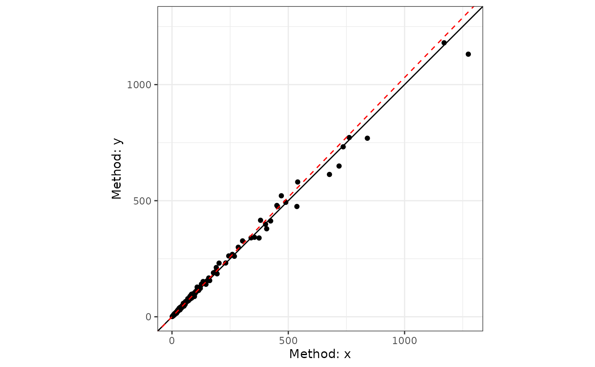

# Errors-in-Variables Regression

## Background

Error-in-variables (EIV) models are useful tools to account for
measurement error in the independent variable. For studies of agreement,
this is particularly useful where there are paired measurements of the
paired measurements (X & Y) of the same underlying value (e.g., two
assays of the same analyte).

Deming regression is one of the simplest forms of of EIV models promoted
by [W. Edwards
Deming](https://en.wikipedia.org/wiki/W._Edwards_Deming)[¹](#fn1). The
first to detail the method were Adcock ([1878](#ref-adcock1878))
followed by Kummell ([1879](#ref-kummell1879)) and Koopmans
([1936](#ref-koopmans1936)). The name comes from the popularity of
Deming’s book ([Deming 1943](#ref-deming1943)), and within the field of
clinical chemistry, the procedure was simply referred to as “Deming
regression” (e.g., Linnet ([1990](#ref-linnet1990))).

## Deming Regression

### Simple Deming Regression

We can start by creating some fake data to work with.

``` r
library(SimplyAgree)

dat = data.frame(
  x = c(7, 8.3, 10.5, 9, 5.1, 8.2, 10.2, 10.3, 7.1, 5.9),
  y = c(7.9, 8.2, 9.6, 9, 6.5, 7.3, 10.2, 10.6, 6.3, 5.2)
)
```

Also, we will assume, based on historical data, that the measurement
error ratio is equal to 2.

The data can be run through the `dem_reg` function and the results
printed.

``` r
dem1 = dem_reg(y ~ x,
               data = dat,
               error.ratio = 2,
               weighted = FALSE)
dem1
#> Deming Regression with 95% C.I. 
#> 
#> Call:
#> dem_reg(formula = y ~ x, data = dat, weighted = FALSE, error.ratio = 2, 
#>     conf.level = 0.95)
#> 
#> Coefficients:
#> (Intercept)           x 
#>      0.1285      0.9745
```

The resulting regression line can then be plotted.

``` r
plot(dem1, interval = "confidence")
```


### Model Diagnostics

The assumptions of the Deming regression model, primarily normality and
homogeneity of variance, can then be checked with the `check` method for
Deming regression results. Both plots appear to be fine with regards to
the assumptions.

``` r
check(dem1)
```


### Fitted Values and Residuals

After fitting a Deming regression model, you can extract the estimated
true values and residuals. The
[`fitted()`](https://rdrr.io/r/stats/fitted.values.html) function
returns the estimated true Y values, accounting for measurement error.
The [`residuals()`](https://rdrr.io/r/stats/residuals.html) function
returns the optimized residuals by default, which correspond to the
perpendicular distances from each point to the regression line.

### Weighted Deming Regression

For this example, I will rely upon the “ferritin” data from the `deming`
R package.

``` r
library(deming)
data('ferritin')

head(ferritin)
#>   id period old.lot new.lot
#> 1  1      1       1       1
#> 2  2      1       3       3
#> 3  3      1      10       9
#> 4  4      1      13      11
#> 5  5      1      13      12
#> 6  6      1      15      13
```

Let me demonstrate the problem with using simple Deming regression when
the weights are helpful. When we look at the two plots below, we can see
there is severe problem with using the “un-weighted” model.

``` r
dem2 = dem_reg(
  old.lot ~ new.lot,
  data = ferritin,
  weighted = FALSE
)
summary(dem2)
#> Deming Regression with 95% C.I. 
#> 
#> Call:
#> dem_reg(formula = old.lot ~ new.lot, data = ferritin, weighted = FALSE, 
#>     conf.level = 0.95)
#> 
#> Coefficients:
#>             coef      bias      se  df lower.ci upper.ci      t p.value
#> Intercept 5.2157 -0.235818 2.18603 160   0.8985    9.533  2.386 0.01821
#> Slope     0.9637  0.002597 0.02505 160   0.9143    1.013 -1.448 0.14949
#> 
#> 160 degrees of freedom
#> Error variance ratio (lambda): 1.0000

plot(dem2)
```


``` r

check(dem2)
```


Now, let us see what happens when `weighted` is set to TRUE.

``` r
dem3 = dem_reg(
  old.lot ~ new.lot,
  data = ferritin,
  weighted = TRUE
)
summary(dem3)
#> Weighted Deming Regression with 95% C.I. 
#> 
#> Call:
#> dem_reg(formula = old.lot ~ new.lot, data = ferritin, weighted = TRUE, 
#>     conf.level = 0.95)
#> 
#> Coefficients:
#>               coef       bias       se  df lower.ci upper.ci       t   p.value
#> Intercept -0.02616  0.0065148 0.033219 160 -0.09176  0.03945 -0.7874 4.322e-01
#> Slope      1.03052 -0.0001929 0.006262 160  1.01815  1.04288  4.8729 2.626e-06
#> 
#> 160 degrees of freedom
#> Error variance ratio (lambda): 1.0000

plot(dem3)
```



``` r

check(dem3)
```


The weighted model provides a better fit.

## Passing-Bablok Regression

Passing-Bablok regression is a robust, nonparametric alternative to
Deming regression for method comparison studies
([**passing1983?**](#ref-passing1983)). Unlike Deming regression, it
makes no assumptions about the distribution of the measurement errors.
The method estimates the slope as the shifted median of all pairwise
slopes between data points, which makes it resistant to outliers.

### When to Use Passing-Bablok

Passing-Bablok regression is particularly useful when:

- Both X and Y are measured with error
- You want a robust method not sensitive to outliers
- The relationship is assumed to be linear
- X and Y are highly positively correlated

### Basic Usage

The
[`pb_reg()`](https://aaroncaldwell.us/SimplyAgree/reference/pb_reg.md)
function implements three variants of Passing-Bablok regression:

- **“scissors”** (default): Most robust, scale-invariant method from
  ([**bablok1988?**](#ref-bablok1988))
- **“symmetric”**: Original method from
  ([**passing1983?**](#ref-passing1983))
- **“invariant”**: Scale-invariant method from
  ([**passing1984?**](#ref-passing1984))

``` r
# Create example data
pb_data <- data.frame(
  method1 = c(69.3, 27.1, 61.3, 50.8, 34.4, 92.3, 57.5, 45.5, 33.3, 60.9,
              56.3, 49.9, 89.7, 28.9, 96.3, 76.6, 83.2, 79.4, 51.7, 32.5,
              99.1, 14.2, 84.1, 48.8, 61.5, 84.9, 93.2, 73.8, 62.1, 98.6),
  method2 = c(69.1, 26.7, 61.4, 51.2, 34.7, 88.5, 57.9, 45.1, 33.4, 60.8,
              66.5, 48.2, 88.3, 29.3, 96.4, 77.1, 82.7, 78.9, 51.6, 28.8,
              98.4, 12.7, 83.6, 47.3, 61.2, 84.6, 92.1, 73.4, 61.9, 98.6)
)

# Fit Passing-Bablok regression
pb1 <- pb_reg(method2 ~ method1, data = pb_data)
#> Warning in pb_reg(method2 ~ method1, data = pb_data): Bootstrap confidence
#> intervals are recommended for 'invariant' and 'scissors' methods. Consider
#> setting replicates > 0.
pb1
#> Passing-Bablok (scissors) with 95% C.I. 
#> 
#> Call:
#> pb_reg(formula = method2 ~ method1, data = pb_data)
#> 
#> Coefficients:
#> (Intercept)     method1 
#>     0.09622     0.99440 
#> 
#> Kendall's Tau (H0: tau <= 0):
#>   tau:       0.9632
#>   p-value:   0.0000
#> 
#> CUSUM Linearity Test:
#>   Test stat: 1.0000
#>   p-value:   0.1844
```

### Summary and Plots

The summary provides details about the regression coefficients and
diagnostic tests:

``` r
summary(pb1)
#> Passing-Bablok (scissors) with 95% C.I. 
#> 
#> Call:
#> pb_reg(formula = method2 ~ method1, data = pb_data)
#> 
#> Coefficients:
#>        term    coef       se lower.ci upper.ci df null_value reject_h0
#> 1 Intercept 0.09622 0.390603  -0.7206   0.8105 28          0     FALSE
#> 2   method1 0.99440 0.005918   0.9840   1.0072 28          1     FALSE
#> 
#> 28 degrees of freedom
#> Error variance ratio (lambda): 1.0000
```

The [`plot()`](https://rdrr.io/r/graphics/plot.default.html) method
displays the regression line with data:

``` r
plot(pb1)
```


### Model Diagnostics

The
[`check()`](https://aaroncaldwell.us/SimplyAgree/reference/simple_agree-methods.md)
method provides diagnostic plots specific to Passing-Bablok regression,
including the CUSUM linearity test and Kendall’s tau correlation:

``` r
check(pb1)
```


### Bootstrap Confidence Intervals

For more robust inference, especially with the “invariant” or “scissors”
methods, bootstrap confidence intervals are recommended:

``` r
pb2 <- pb_reg(method2 ~ method1, 
              data = pb_data, 
              replicates = 999)
summary(pb2)
#> Passing-Bablok (scissors) with 95% C.I. 
#> 
#> Call:
#> pb_reg(formula = method2 ~ method1, data = pb_data, replicates = 999)
#> 
#> Coefficients:
#>        term    coef       se lower.ci upper.ci df null_value reject_h0
#> 1 Intercept 0.09622 0.088205 -0.09182   0.2539 28          0     FALSE
#> 2   method1 0.99440 0.001291  0.99198   0.9970 28          1      TRUE
#> 
#> 28 degrees of freedom
#> Error variance ratio (lambda): 1.0000
#> 
#> 
#> Bootstrap CIs based on 999 resamples
```

## Joint Confidence Regions

A theoretically valid, but still experimental, enhancement to the
`dem_reg` and `pb_reg` functions is the addition of **joint confidence
regions** for the slope and intercept parameters. Traditional confidence
intervals treat each parameter separately, but in regression analysis,
these parameters are correlated.

Joint confidence regions account for this correlation by creating an
elliptical region in the (intercept, slope) parameter space. This
approach, promoted by Sadler ([2010](#ref-sadler2010)), provides several
advantages:

- **Higher Statistical Power**: The ellipse typically requires 20-50%
  fewer samples than traditional confidence intervals to detect the same
  bias
- **Accounts for Parameter Correlation**: When the measurement range is
  narrow, slope and intercept are highly negatively correlated
- **More Appropriate Test**: Testing against a point (e.g., slope=1,
  intercept=0) is naturally done with a region, not separate intervals

The power advantage is most pronounced when the ratio of maximum to
minimum X values is small (\< 10:1), which is common in clinical method
comparisons.

### Visualizing the Joint Confidence Region

The
[`plot_joint()`](https://aaroncaldwell.us/SimplyAgree/reference/simple_eiv-methods.md)
function allows visualization of the confidence region in parameter
space:

``` r
plot_joint(dem1, 
           ideal_slope = 1, 
           ideal_intercept = 0,
           show_intervals = TRUE)
```


This plot shows:

- The **red ellipse**: Joint confidence region
- The **blue rectangle**: Traditional confidence intervals
- The **black dot**: Estimated (intercept, slope)
- The **green/red X**: Ideal point (whether enclosed or not)

Notice how the ellipse is smaller than the rectangle, especially in the
directions that matter for detecting bias.

For Passing-Bablok regression, bootstrap resampling must be used to
obtain the variance-covariance matrix needed for the joint confidence
region:

``` r
plot_joint(pb2)
```


### Joint Hypothesis Test

The
[`joint_test()`](https://aaroncaldwell.us/SimplyAgree/reference/joint_test.md)
function provides a formal hypothesis test for whether the identity line
(slope = 1, intercept = 0) falls within the joint confidence region:

``` r
joint_test(dem1)
#> 
#>  Joint Confidence Region Test (H0: intercept = 0, slope = 1)
#> 
#> data:  y ~ x
#> X-squared = 0.21666, df = 2, p-value = 0.8973
#> alternative hypothesis: true intercept and slope are not equal to the null values
#> null values:
#> intercept     slope 
#>         0         1 
#> sample estimates:
#> intercept     slope 
#> 0.1284751 0.9744516
```

This returns an `htest` object with the Mahalanobis distance
(chi-squared statistic) and p-value. The test can also be applied to
Passing-Bablok models fitted with bootstrap:

``` r
joint_test(pb2)
#> 
#>  Joint Confidence Region Test (H0: intercept = 0, slope = 1)
#> 
#> data:  method2 ~ method1
#> X-squared = 905.61, df = 2, p-value < 2.2e-16
#> alternative hypothesis: true intercept and slope are not equal to the null values
#> null values:
#> intercept     slope 
#>         0         1 
#> sample estimates:
#>  intercept      slope 
#> 0.09621849 0.99439776
```

## Theoretical Details

### Deming Calculative Approach

Deming regression assumes paired measures (\\x_i, \space y_i\\) are each
measured with error.

\\ x_i = X_i + \epsilon_i \\

\\ y_i = Y_i + \delta_i \\

We can then measure the relationship between the two variables with the
following model.

\\ \hat Y_i = \beta_0 + \beta_1 \cdot \hat X_i \\

Traditionally there are 2 null hypotheses.

First, the intercept is equal to zero:

\\ H_0: \beta_0 = 0 \space vs. \space H_1: \beta_0 \ne 0 \\

Second, that the slope is equal to one:

\\ H_0: \beta_1 = 1 \space vs. \space H_1: \beta_0 \ne 1 \\

## Joint Confidence Region Calculative Approach

The joint \\(1-\alpha) \times 100\\\\ confidence region for \\(\beta_0,
\beta_1)\\ is defined as:

\\ (\hat{\beta} - \beta_0)^T V^{-1} (\hat{\beta} - \beta_0) \leq
\chi^2\_{2,\alpha} \\

Where:

- \\\hat{\beta}\\ = estimated parameters \\(\hat{\beta}\_0,
  \hat{\beta}\_1)\\
- \\\beta_0\\ = hypothesized parameters (e.g., \\(0, 1)\\ for identity)
- \\V\\ = variance-covariance matrix
- \\\chi^2\_{2,\alpha}\\ = chi-square critical value with 2 degrees of
  freedom

This forms an ellipse in parameter space that accounts for the
correlation between slope and intercept.

### Measurement Error

A Deming regression model also assumes the measurement error
(\\\sigma^2\\) ratio is constant.

\\ \lambda = \frac{\sigma^2\_\epsilon}{\sigma^2\_\delta} \\

In `SimplyAgree`, the error ratio can be set with the `error.ratio`
argument. It defaults to 1, but can be changed by the user. If replicate
measures are taken, then the user can use the `id` argument to indicate
which measures belong to which subject/participant. The measurement
error, and the error ratio, will then be estimated from the data itself.

If the data was not measured in replicate then the error ratio
(\\\lambda\\) can be estimated from the coefficient of variation (if
that data is available) and the mean of x and y (\\\bar x, \space \bar
y\\).

\\ \lambda = \frac{(CV_y \cdot \bar y)^2}{(CV_x \cdot \bar x)^2} \\

### Weights

In some cases the variance of X and Y may increase proportional to the
true value of the measure. In these cases, it may be prudent to use
“weighted” Deming regression models. The weights used in `SimplyAgree`
are the same as those suggested by Linnet ([1993](#ref-linnet1993)).

\\ \hat w_i = \frac{1}{ \[ \frac{x_i + \lambda \cdot y_i}{1 +
\lambda}\]^2} \\

Weights can also be provided through the `weights` argument. If weighted
Deming regression is not selected (`weighted = FALSE`), the weights for
each observation is equal to 1.

The estimated mean of X and Y are then estimated as the following.

\\ \bar x_w = \frac{\Sigma^{N}\_{i=1} \hat w_i \cdot
x_i}{\Sigma^{N}\_{i=1} \hat w_i} \\

\\ \bar y_w = \frac{\Sigma^{N}\_{i=1} \hat w_i \cdot
y_i}{\Sigma^{N}\_{i=1} \hat w_i} \\

### Estimating the Slope and Intercept

First, there are 3 components (\\v_x, \space v_y, \space cov\_{xy}\\)

\\ v_x = \Sigma\_{i=1}^N \space \hat w_i \cdot (x_i- \bar x_w)^2 \\ \\
v_y = \Sigma\_{i=1}^N \space \hat w_i \cdot (y_i- \bar y_w)^2 \\ \\
cov\_{xy} = \Sigma\_{i=1}^N \space \hat w_i \cdot (x_i- \bar x_w) \cdot
(y_i- \bar y_w) \\

The slope (\\b_1\\) can then be estimated with the following equation.

\\ b_1 = \frac{(\lambda \cdot v_y - v_x) + \sqrt{(v_x-\lambda \cdot
v_y)^2 + 4 \cdot \lambda \cdot cov\_{xy}^2}}{2 \cdot \lambda \cdot
cov\_{xy}} \\

The intercept (\\b_0\\) can then be estimated with the following
equation.

\\ b_0 = \bar y_w - b_1 \cdot \bar x_w \\

The standard errors of b1 and b0 are both estimated using a jackknife
method (detailed by Linnet ([1990](#ref-linnet1990))).

## References

Adcock, R J. 1878. “A Problem in Least Squares.” *The Analyst* 5 (2):
53. <https://doi.org/10.2307/2635758>.

Deming, W E. 1943. *Statistical Adjustment of Data*. Wiley.

Koopmans, Tjalling Charles. 1936. *Linear Regression Analysis of
Economic Time Series*. Vol. 20. DeErven F. Bohn, Haarlem, Netherlands.

Kummell, C H. 1879. “Reduction of Observation Equations Which Contain
More Than One Observed Quantity.” *The Analyst* 6 (4): 97.
<https://doi.org/10.2307/2635646>.

Linnet, Kristian. 1990. “Estimation of the Linear Relationship Between
the Measurements of Two Methods with Proportional Errors.” *Statistics
in Medicine* 9 (12): 1463–73. <https://doi.org/10.1002/sim.4780091210>.

———. 1993. “Evaluation of Regression Procedures for Methods Comparison
Studies.” *Clinical Chemistry* 39 (3): 424–32.

Sadler, W A. 2010. “Joint Parameter Confidence Regions Improve the Power
of Parametric Regression in Method-Comparison Studies.” *Accreditation
Qual. Assur.* 15 (10): 547–54.

------------------------------------------------------------------------

1.  Deming was a titan of the fields of statistics and engineering and I
    would highly recommend reading some of his academic work and books
