# Agreement Tests

The `SimplyAgree` R package was created to make the process of
quantifying measurement agreement, consistency, and reliability. This
package expands upon the capabilities of currently available R packages
(such as `psych` and `blandr`) by 1) providing support for agreement
studies that involve multiple observations (`agree_test` and
`agree_reps` functions) 2) provide robust tests of agreement even in
simple studies (`shieh_test` output from the `agree_test` function) and
3) a robust set of reliability statistics (`reli_stats` function).

In this vignette I will briefly demonstrate the implementation of the
functions that include tests of agreement. *Please note*, I would
recommend using the `agreement_limit` function over these older
functions with the exception of `agree_np` which provides non-parametric
agreement limits.

``` r
library(SimplyAgree)
```

## Simple Agreement

### `agree_test`

In the simplest scenario, a study may be conducted to compare one
measure (e.g., `x`) and another (e.g., `y`). In this scenario each pair
of observations (x and y) are *independent*; meaning that each pair
represents one subject/participant. In most cases we have a degree of
agreement that we would deem adequate. This may constitute a hypothesis
wherein you may believe the agreement between two measurements is within
a certain limit (limits of agreement). If this is the goal then the
`agree_test` function is what you need to use in this package.

The data for the two measurements are put into the `x` and `y`
arguments. If there is a hypothesized limit of agreement then this can
be set with the `delta` argument (this is optional). Next, the limit of
agreement can be set with the `agree.level` and the confidence level
(\\1-\alpha\\). Once those are set the analysis can be run. Please note,
this package has pre-loaded data from the Zou 2013 paper. While data
does not conform the assumptions of the test it can be used to test out
many of the functions in this package. Since there isn’t an *a priori*
hypothesis I will not declare a `delta` argument, but I will estimate
the 95% confidence intervals for 80% limits of agreement.

``` r
a1 = agree_test(x = reps$x,
                y = reps$y,
                agree.level = .8)
#> Warning: `agree_test()` was deprecated in SimplyAgree 0.2.0.
#> ℹ Please use `agreement_limit()` instead.
#> This warning is displayed once per session.
#> Call `lifecycle::last_lifecycle_warnings()` to see where this warning was
#> generated.
```

We can then print the general results. These results include the general
parameters of the analysis up top, then the results of the Shieh exact
test for agreement (no conclusion is included due to the lack of a
`delta` argument being set). Then the limits of agreement, with
confidence limits, are included. Lastly, Lin’s Concordance Correlation
Coefficient, another measure of agreement, is also included.

``` r
print(a1)
#> Limit of Agreement = 80%
#> 
#> ###- Shieh Results -###
#> Exact 90% C.I.  [-1.512, 2.3887]
#> Hypothesis Test: No Hypothesis Test
#> 
#> ###- Bland-Altman Limits of Agreement (LoA) -###
#>           Estimate Lower CI Upper CI CI Level
#> Bias        0.4383  -0.1669   1.0436     0.95
#> Lower LoA  -1.1214  -1.8037  -0.4391     0.90
#> Upper LoA   1.9980   1.3157   2.6803     0.90
#> 
#> ###- Concordance Correlation Coefficient (CCC) -###
#> CCC: 0.4791, 95% C.I. [0.1276, 0.7237]
```

Next, we can use the generic `plot` function to produce visualizations
of agreement. This includes the Bland-Altman plot (`type = 1`) and a
line-of-identity plot (`type = 2`).

``` r
plot(a1, type = 1)
```

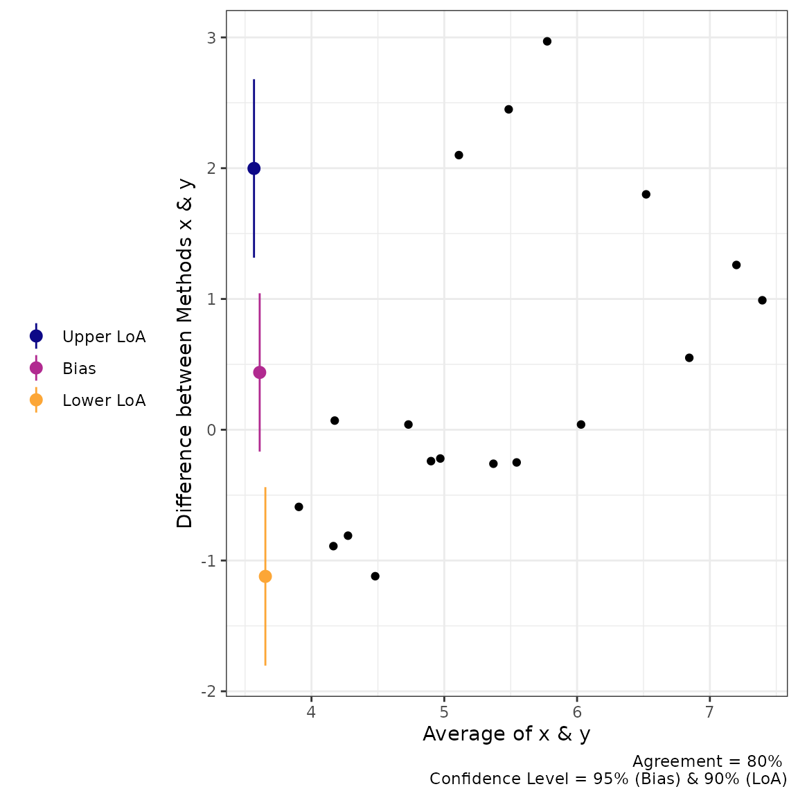

``` r

plot(a1, type = 2) 
```


### Calculations in for Simple Agreement

#### Shieh’s test

The hypothesis test procedure is based on the “exact” approach details
by Shieh ([2019](#ref-shieh2019)). In this procedure the null hypothesis
(not acceptable agreement) is rejected if the extreme lower bound and
upper bound are within the proposed agreement limits. The agreement
limits, \\\hat\theta\_{EL}\\ and \\\hat\theta\_{EU}\\ respectively, are
calculated as the following:

\\ \hat\theta\_{EL,EU} = \bar{d} \pm \gamma\_{1-\alpha}\cdot
\frac{S}{\sqrt{N}} \\

wherein \\\bar{d}\\ is the mean difference between the two methods,
\\S\\ is the standard deviation of the differences, \\N\\ is the total
number of pairs, and \\\gamma\_{1-\alpha}\\ critical value (which
requires a specialized function within `R` to estimate).

#### Limits of Agreement

The reported limits of agreement are derived from the work of Bland and
Altman ([1986](#ref-bland1986)) and Bland and Altman
([1999](#ref-bland1999)).

**LoA**

\\ LoA = \bar d \pm z\_{1-(1-agree)/2} \cdot S_d \\ wherein
\\z\_{1-(1-agree)/2}\\ is the value of the normal distribution at the
given agreement level (default is 95%), \\\bar d\\ is the mean of the
differences, and \\S_d\\ is the standard deviations of the differences.

**Confidence Interval**

\\ LoA\_{C.I.} = LoA \pm t\_{1-\alpha/2,N-1} \cdot
\sqrt{\left\[\frac{1}{N}+\frac{(z\_{1-\alpha/2})^{2}}{2 \cdot (N-1)}
\right\] \cdot S^2} \\

wherein, \\t\\ is the critical t-value at the given sample size and
confidence level (`conf.level`), \\z\\ is the value of the normal
distribution at the given alpha level (`agree.level`), and \\S^2\\ is
the variance of the difference scores. If `TOST` is set to TRUE then
equation is altered slightly with the critical t
(\\t\_{1-\alpha,N-1}\\).

#### Concordance Correlation Coefficient

The CCC was calculated as outlined by Lin ([1989](#ref-lin1989)) (with
later corrections).

\\ \hat\rho_c = \frac{2 \cdot s\_{xy}} {s_x^2 + s_y^2+(\bar x-\bar y)^2}
\\ where \\s\_{xy}\\ is the covariance, \\s_x^2\\ and \\s_y^2\\ are the
variances of x and y respectively, and \\(\bar x-\bar y)\\ is the
difference in the means of x & y.

## Repeated Measures Agreement

In many cases there are multiple measurements taken within subjects when
comparing two measurements tools. In some cases the true underlying
value will not be expected to vary (i.e., replicates; `agree_reps`), or
multiple measurements may be taken within an individual *and* these
values are expected to vary (i.e., nested design; `agree_nest`).

The confidence limits on the limits of agreement are based on the
“MOVER” method described in detail by Zou ([2011](#ref-zou2011)).
However, both functions operate similarly to `agree_test`; the only
difference being that the data has to be provided as a `data.frame` in
R.

### `agree_reps`

This function is for cases where the underlying values do *not* vary
within subjects. This can be considered cases where replicate measure
may be taken. For example, a researcher may want to compare the
performance of two ELISA assays where measurements are taken in
duplicate/triplicate.

So, for this function you will have to provide the data frame object
with the `data` argument and the names of the columns containing the
first (`x` argument) and second (`y` argument) must then be provided. An
additional column indicating the subject identifier (`id`) must also be
provided. Again, if there is a hypothesized agreement limit then this
could be provided with the `delta` argument.

``` r
a2 = agree_reps(x = "x",
                y = "y",
                id = "id",
                data = reps,
                agree.level = .8)
#> Warning: `agree_reps()` was deprecated in SimplyAgree 0.2.0.
#> ℹ Please use `agreement_limit()` instead.
#> This warning is displayed once per session.
#> Call `lifecycle::last_lifecycle_warnings()` to see where this warning was
#> generated.
```

The results can then be printed. The printing format is very similar to
`agree_test`, but notice that 1) the hypothesis test is based on the
limits of agreement (MOVER method), 2) the Concordance Correlation
Coefficient is calculated via the U-statistics method, 3) the Shieh TOST
results are missing because they cannot be estimated for this type of
design.

``` r
print(a2)
#> Limit of Agreement = 80%
#> Replicate Data Points (true value does not vary)
#> 
#> Hypothesis Test: No Hypothesis Test
#> 
#> ###- Bland-Altman Limits of Agreement (LoA) -###
#>           Estimate Lower CI Upper CI CI Level
#> Bias        0.7152  -0.6667   2.0971     0.95
#> Lower LoA  -1.2117  -4.7970   0.1054     0.90
#> Upper LoA   2.6421   1.3250   6.2274     0.90
```

``` r
plot(a2, type = 1)
```


``` r

plot(a2, type = 2)
```

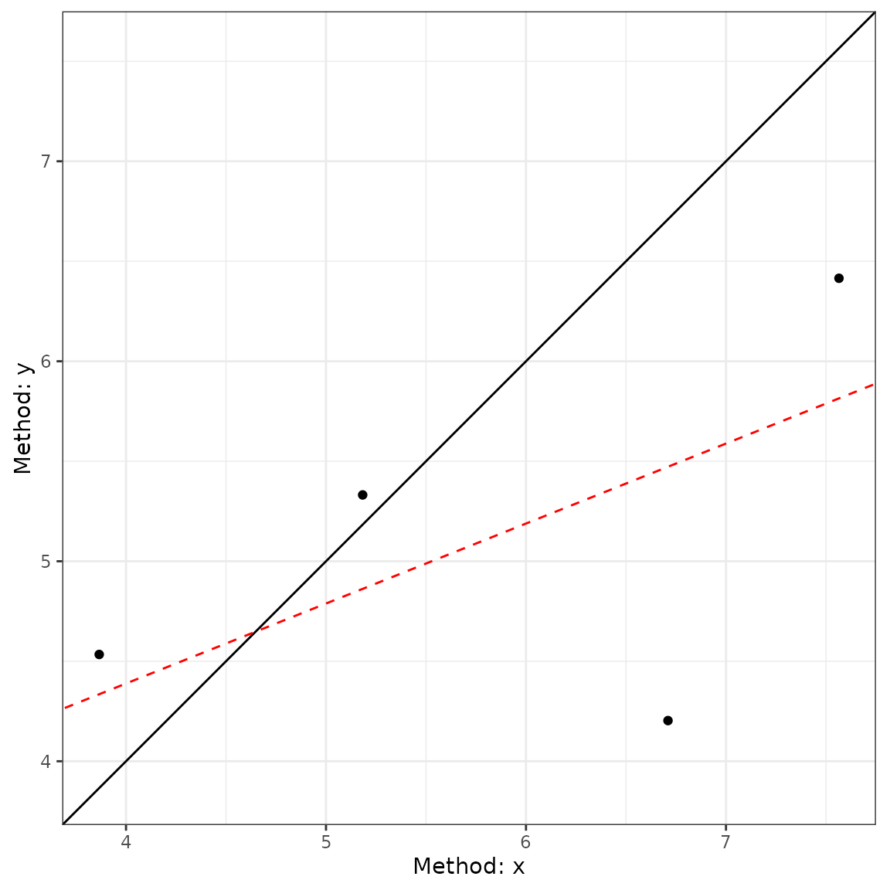

### `agree_nest`

This function is for cases where the underlying values may vary within
subjects. This can be considered cases where there are distinct pairs of
data wherein data is collected in different times/conditions within each
subject. An example would be measuring blood pressure on two different
devices on many people at different time points/days.

The function works almost identically to `agree_reps` but the underlying
calculations are different

``` r
a3 = agree_nest(x = "x",
                y = "y",
                id = "id",
                data = reps,
                agree.level = .8)
#> Warning: `agree_nest()` was deprecated in SimplyAgree 0.2.0.
#> ℹ Please use `agreement_limit()` instead.
#> This warning is displayed once per session.
#> Call `lifecycle::last_lifecycle_warnings()` to see where this warning was
#> generated.
```

The printed results (and plots) are very similar to `agree_reps`.
However, the CCC result now has a warning because the calculation in
this scenario may not be entirely appropriate given the nature of the
data.

``` r
print(a3)
#> Limit of Agreement = 80%
#> Nested Data Points (true value may vary)
#> 
#> Hypothesis Test: No Hypothesis Test
#> 
#> ###- Bland-Altman Limits of Agreement (LoA) -###
#>           Estimate Lower CI Upper CI CI Level
#> Bias        0.7101  -0.6824   2.1026     0.95
#> Lower LoA  -1.1626  -4.8172   0.1811     0.90
#> Upper LoA   2.5828   1.2390   6.2374     0.90
```

``` r
plot(a3, type = 1)
```

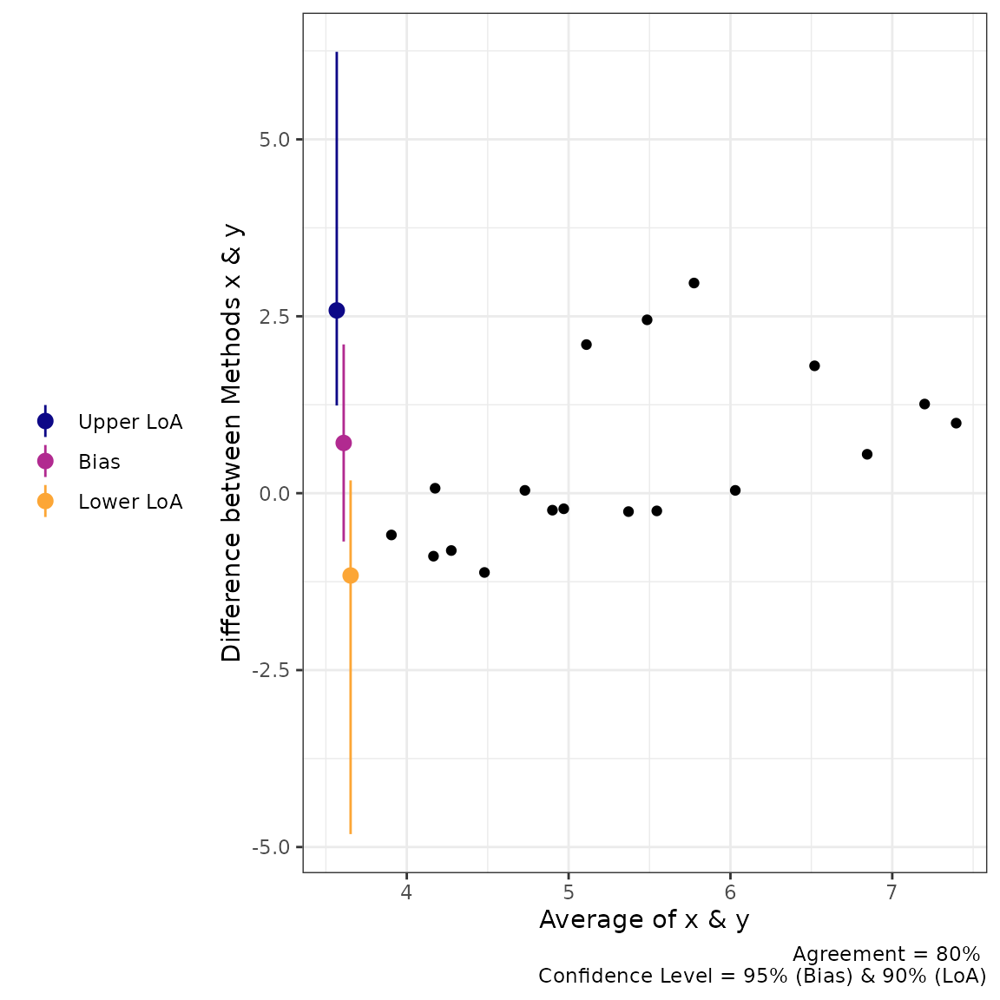

``` r

plot(a3, type = 2)
```

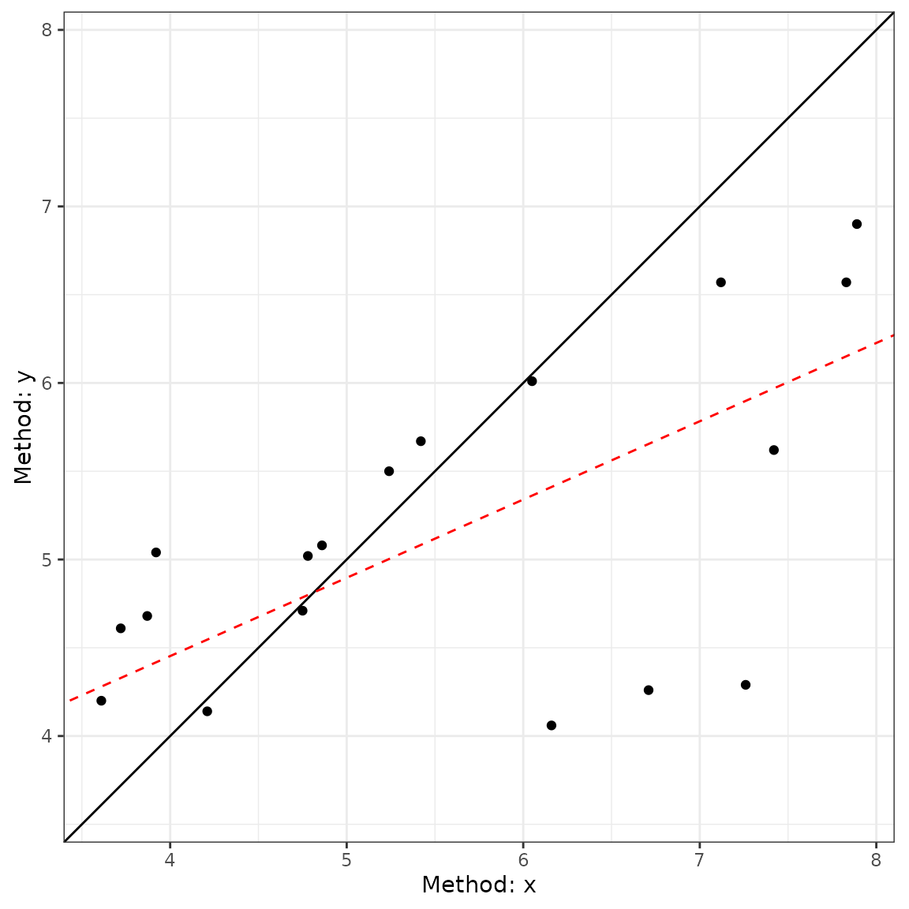

### Calculations for `agree_reps` & `agree_nest`

All the calculations for the limits of agreement in these two functions
can be found in the article by Zou ([2011](#ref-zou2011)).

### `agree_nest` LoA

**Step 1: Calculate Individual Subject Means and Variances**

\\ \bar x_i = \frac{1}{n\_{xi}} \Sigma\_{j=1}^{n\_{xi}} x\_{ij} \\ \\
\bar y_i = \frac{1}{n\_{yi}} \Sigma\_{j=1}^{n\_{yi}} y\_{ij} \\ \\ \bar
d_i = \bar x_i - \bar y_i \\

\\ \bar d = \Sigma\_{i=1}^{n}\frac{d_i}{n} \\

\\ s\_{xi}^2 = \Sigma\_{j=1}^{n\_{xi}} \frac{(x\_{xj}- \bar
x_i)^2}{n\_{xi}-1} \\

\\ s\_{yi}^2 = \Sigma\_{j=1}^{n\_{yi}} \frac{(y\_{ij}- \bar
y_i)^2}{n\_{yi}-1} \\

\\ s\_{\bar d}^2 = \Sigma\_{j=1}^{n} \frac{(d\_{i}- \bar d)^2}{n-1} \\

**Step 2: Compute pooled estimates of within subject errors**

\\ s^2\_{xw} = \Sigma\_{i=1}^{n} \[\frac{n\_{xi} -1}{N_x -1} \cdot
s^2\_{xi}\] \\

\\ s^2\_{yw} = \Sigma\_{i=1}^{n} \[\frac{n\_{yi} -1}{N_y -1} \cdot
s^2\_{yi}\] \\

**Step 3: Compute Harmonic Means of Replicates**

\\ m\_{xh} = \frac{n}{\Sigma\_{i=1}^n \frac{1}{n\_{xi}}} \\

\\ m\_{yh} = \frac{n}{\Sigma\_{i=1}^n \frac{1}{n\_{yi}}} \\ **Step 4:
Compute the variance of the differences**

\\ s^2_d = s^2\_{\bar d} + (1+\frac{1}{m\_{xh}}) \cdot s^2\_{xw} +
(1+\frac{1}{m\_{yh}}) \cdot s^2\_{yw} \\ **Step 5: Compute MOVER
Components**

\\ S\_{11} = s\_{\bar d}^2 \cdot (1 - \frac{n-1}{\chi^2\_{(1-\alpha,
n-1)}}) \\

\\ S\_{12} = (1-\frac{1}{m\_{xh}}) \cdot (1 -
\frac{N_x-n}{\chi^2\_{(1-\alpha, N_x-n)}}) \cdot s^2\_{xw} \\ \\ S\_{13}
= (1-\frac{1}{m\_{yh}}) \cdot (1 - \frac{N_y-n}{\chi^2\_{(1-\alpha,
N_y-n)}}) \cdot s^2\_{yw} \\

\\ S_1 = \sqrt{S\_{11}^2 +S\_{12}^2 +S\_{13}^2} \\ \\ l = s_d^2 - S_1 \\

\\ u = s_d^2 + S_1 \\

\\ LME = \sqrt{\frac{z^2\_{\alpha} \cdot s_d^2}{n} + z^2\_{\beta/2}
\cdot(\sqrt{u} - \sqrt{s^2_d})^2} \\

\\ RME = \sqrt{\frac{z^2\_{\alpha} \cdot s_d^2}{n} + z^2\_{\beta/2}
\cdot(\sqrt{l} - \sqrt{s^2_d})^2} \\ \### LoA

\\ LoA\_{lower} = \bar d - z\_{\beta/2} \cdot s_d \\

\\ LoA\_{upper} = \bar d + z\_{\beta/2} \cdot s_d \\

#### Lower LoA CI

\\ Lower \space CI = LoA\_{lower} - LME \\

\\ Upper \space CI = LoA\_{lower} + RME \\

#### Upper LoA CI

\\ Lower \space CI = LoA\_{upper} - RME \\

\\ Upper \space CI = LoA\_{upper} + LME \\

### `agree_reps` LoA

#### LoA

**Step 1: Compute mean and variance**

\\ \bar d_i = \Sigma\_{j=1}^{n_i} \frac{d\_{ij}}{n_i} \\ \\ \bar d =
\Sigma^{n}\_{i=1} \frac{d_i}{n} \\

\\ s_i^2 = \Sigma\_{j=1}^{n_i} \frac{(d\_{ij} - \bar d_i)^2}{n_i-1} \\
**Step 2: Compute pooled estimate of within subject error**

\\ s\_{dw}^2 = \Sigma\_{i=1}^{n} \[\frac{n_i-1}{N-n} \cdot s_i^2\] \\

**Step 3: Compute pooled estimate of between subject error**

\\ s^2_b = \Sigma\_{i=1}^n \frac{ (\bar d_i - \bar d)^2}{n-1} \\

**Step 4: Compute the harmonic mean of the replicate size**

\\ m_h = \frac{n}{\Sigma\_{i=1}^n m_i^{-1}} \\

**Step 5: Compute SD of the difference**

\\ s_d^2 = s^2_b + (1+m_h^{-1}) \cdot s\_{dw}^2 \\ **Step 6: Calculate l
and u**

\\ l = s_d^2 - \sqrt{\[s_d^2 \cdot (1 - \frac{n-1}{\chi^2\_{(1-\alpha,
n-1)}})\]^2+\[(1-m_h^{-1}) \cdot (1- \frac{N-n}{\chi^2\_{(1-\alpha,
N-n)}})\]^2} \\ \\ u = s_d^2 + \sqrt{\[s_d^2 \cdot (1 -
\frac{n-1}{\chi^2\_{(1-\alpha, n-1)}})\]^2+\[(1-m_h^{-1}) \cdot (1-
\frac{N-n}{\chi^2\_{(1-\alpha, N-n)}})\]^2} \\ **Step 7: Compute LME and
RME**

\\ LME = \sqrt{\frac{z\_{\alpha} \cdot s_d^2}{n} + z\_{\beta/2}^2 \cdot
(\sqrt{u}-\sqrt{s^2_d} )^2} \\

\\ RME = \sqrt{\frac{z\_{\alpha} \cdot s_d^2}{n} + z\_{\beta/2}^2 \cdot
(\sqrt{l}-\sqrt{s^2_d} )^2} \\

#### LoA

\\ LoA\_{lower} = \bar d - z\_{\beta/2} \cdot s_d \\

\\ LoA\_{upper} = \bar d + z\_{\beta/2} \cdot s_d \\

#### Lower LoA CI

\\ Lower \space CI = LoA\_{lower} - LME \\

\\ Upper \space CI = LoA\_{lower} + RME \\

#### Upper LoA CI

\\ Lower \space CI = LoA\_{upper} - RME \\

\\ Upper \space CI = LoA\_{upper} + LME \\

### CCC from U-statistics

The CCC calculations are derived from the `cccUst` function of the
`cccrm` R package. The mathematics for this CCC calculation can be found
in the work of King, Chinchilli, and Carrasco ([2007](#ref-king2007))
and Carrasco, King, and Chinchilli ([2009](#ref-carrasco2009)).

## Checking Assumptions

The assumptions of normality, heteroscedasticity, and proportional bias
can all be checked using the `check` method.

The function will provide 3 plots: Q-Q normality plot, standardized
residuals plot, and residuals plot.

All 3 plots will have a statistical test in the bottom right corner. The
Shapiro-Wilk test is included for the normality plot, the Bagan-Preusch
test for heterogeneity, and the test for linear slope on the residuals
plot.

### An Example

``` r
a1 = agree_test(x = reps$x,
                y = reps$y,
                agree.level = .8)

check(a1)
```

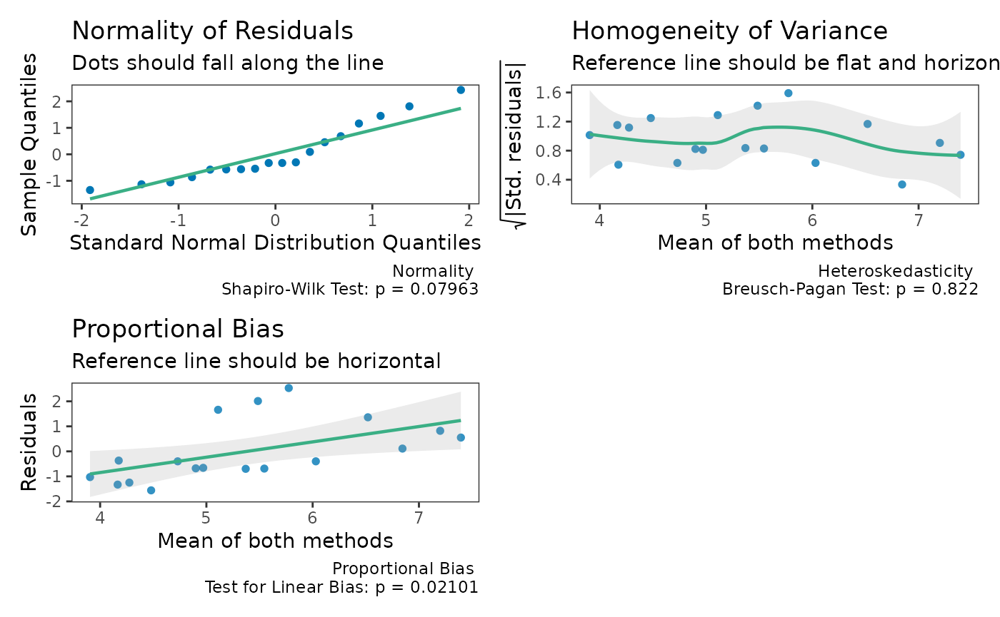

## Proportional Bias

As the check plots for `a1` show, proportional bias can sometimes occur.
In these cases Bland and Altman ([1999](#ref-bland1999)) recommended
adjusting the bias and LoA for the proportional bias. This is simply
done by include a slope for the average of both measurements (i.e, using
an intercept + slope model rather than intercept only model).

For any of the “agree” functions, this can be accomplished with the
`prop_bias` argument. When this is set to TRUE, then the proportional
bias adjusted model is utilized. However, you should be careful with
interpreting the hypothesis tests in these cases because the results are
likely bogus for the extreme ends of the measurement. In any case, plots
of the data should always be inspected

``` r
a1 = agree_test(x = reps$x,
                y = reps$y,
                prop_bias = TRUE,
                agree.level = .8)
#> prop_bias set to TRUE. Hypothesis test may be bogus. Check plots.
print(a1)
#> Limit of Agreement = 80%
#> 
#> ###- Shieh Results -###
#> Exact 90% C.I.  [-1.2551, 2.1318]
#> Hypothesis Test: No Hypothesis Test
#> note: hypothesis test likely bogus with proportional bias.
#> ###- Bland-Altman Limits of Agreement (LoA) -###
#>           Estimate Lower CI Upper CI CI Level
#> Bias        0.4383 -0.08968   0.9663     0.95
#> Lower LoA  -0.9159 -1.51049  -0.3213     0.90
#> Upper LoA   1.7926  1.19801   2.3872     0.90
#> 
#> LoA at average of both measures. Please check plot.
#> ###- Concordance Correlation Coefficient (CCC) -###
#> CCC: 0.4791, 95% C.I. [0.1276, 0.7237]

plot(a1)
```

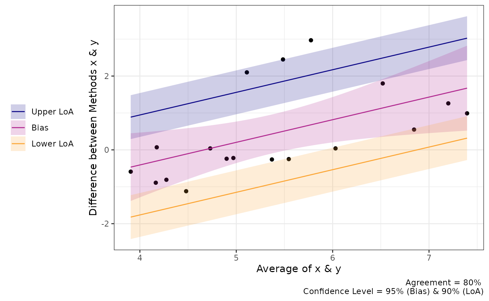

## Non-parametric Alternatives

When the assumptions of any of the tests above are violated then a
non-parametric alternative may be useful. The `agree_np` function is the
non-parametric alternative for the `SimpleAgree` R package, and is
largely based on the recommendations of Bland & Altman ([Bland and
Altman 1999](#ref-bland1999), pg. 157).

The function performs two tests:

1.  A binomial test on whether or not the observed differences are
    within the maximal allowable differences bounds (`delta` argument).
2.  Quantile regression, derived from the `quantreg` package ([Koenker
    2020](#ref-quantreg)), two estimate the median and 95% limits of
    agreement. If the default agreement levels are used
    (`agree.level = .95`) then the 0.025, 0.5 (median), and 0.975
    quantiles are estimated.

The function also *requires* the `delta` argument (otherwise the
binomial test would be useless). Otherwise, it functions just like the
other agreement functions.

In the code demo below, you will notice that the limits of agreement are
no longer symmetric around the bias estimate.

``` r
a1 = agree_np(x = "x",
              y = "y",
              data = reps,
              delta = 2,
              prop_bias = FALSE,
              agree.level = .8)
print(a1)
#> Limit of Agreement = 80%
#> Binomial proportions test and quantile regression for LoA
#> 
#>            agreement lower.ci upper.ci
#> % within 2    0.8333   0.5914   0.9453
#> Hypothesis Test: don't reject h0
#> 
#> ###- Quantile Limits of Agreement (LoA) -###
#>           Estimate Lower CI Upper CI CI Level
#> Lower LoA    -0.89  -1.3739  -0.4061     0.90
#> Bias          0.04  -0.5234   0.6034     0.95
#> Upper LoA     2.45   1.4983   3.4017     0.90

plot(a1)
```

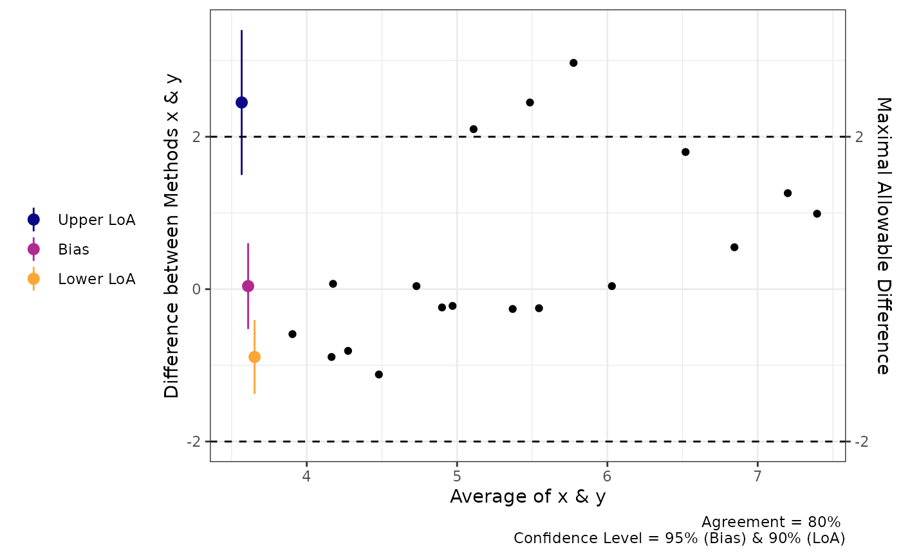

We can also perform the same analysis with proportional bias no longer
assumed. You can see that the LoA changes but the test for agreement
does not.

``` r
a1 = agree_np(x = "x",
              y = "y",
              data = reps,
              delta = 2,
              prop_bias = TRUE,
              agree.level = .8)
print(a1)
#> Limit of Agreement = 80%
#> Binomial proportions test and quantile regression for LoA
#> 
#>            agreement lower.ci upper.ci
#> % within 2    0.8333   0.5914   0.9453
#> Hypothesis Test: don't reject h0
#> 
#> ###- Quantile Limits of Agreement (LoA) -###
#>                  Estimate Lower CI Upper CI CI Level
#> Lower LoA @ 3.9  -1.28975  -1.7203 -0.85925     0.90
#> Lower LoA @ 5.24 -0.45436  -0.6465 -0.26221     0.90
#> Lower LoA @ 7.4   0.89417   0.6088  1.17953     0.90
#> Bias @ 3.9       -0.73052  -1.5079  0.04682     0.95
#> Bias @ 5.24      -0.07238  -0.7088  0.56406     0.95
#> Bias @ 7.4        0.99000  -0.4509  2.43089     0.95
#> Upper LoA @ 3.9  -0.38310  -2.9310  2.16480     0.90
#> Upper LoA @ 5.24  2.01069   1.0814  2.93996     0.90
#> Upper LoA @ 7.4   5.87483   2.3417  9.40794     0.90

plot(a1)
```

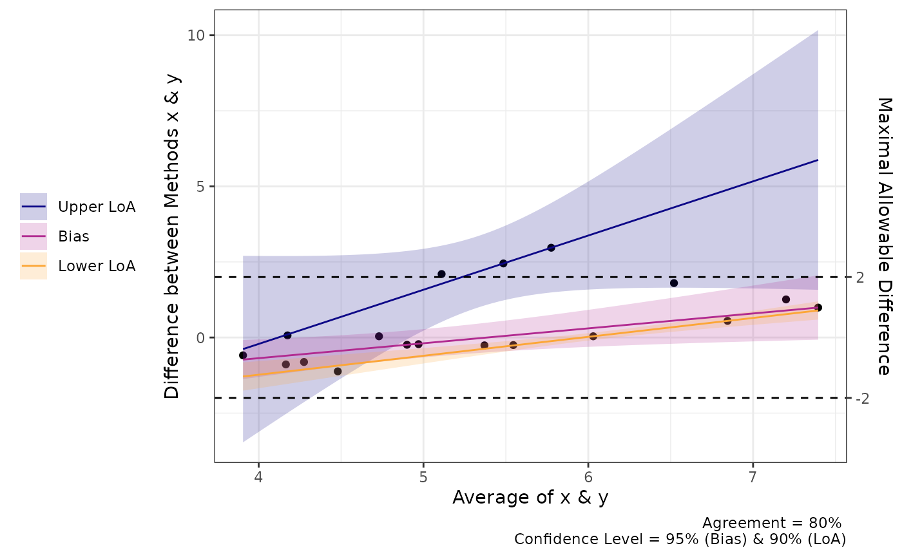

## “Big” Data

Sometimes there may be a lot of data and individual points of data on
Bland-Altman plot may be less than ideal. In order to change the plots
from showing the individual data points we can modify the `geom_point`
argument.

``` r
set.seed(81346)
x = rnorm(750, 100, 10)
diff = rnorm(750, 0, 1)
y = x + diff

df = data.frame(x = x,
                y = y)

a1 = agree_test(x = df$x,
                y = df$y,
                #prop_bias =TRUE,
                agree.level = .95)

plot(a1, 
     geom = "geom_point")
```

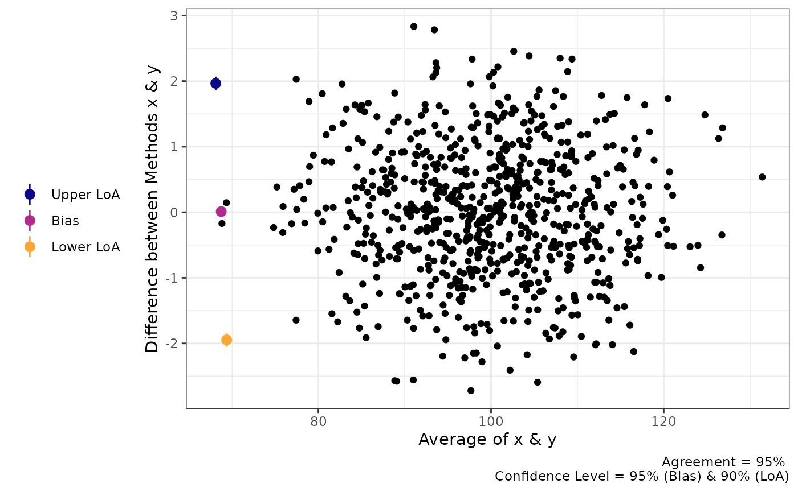

``` r

plot(a1, 
     geom = "geom_bin2d")
#> `stat_bin2d()` using `bins = 30`. Pick better value `binwidth`.
```

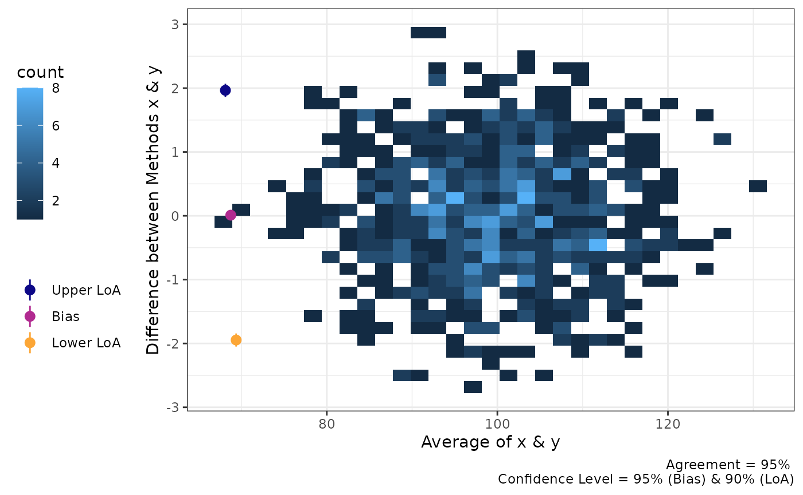

``` r

plot(a1,
     geom = "geom_density_2d")
```

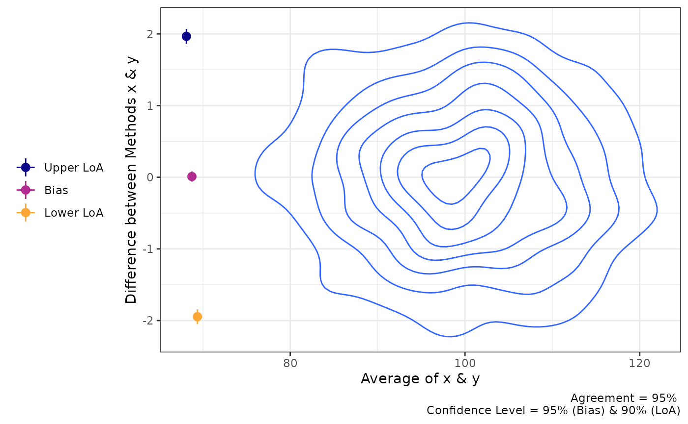

``` r

plot(a1,
     geom = "geom_density_2d_filled")
```

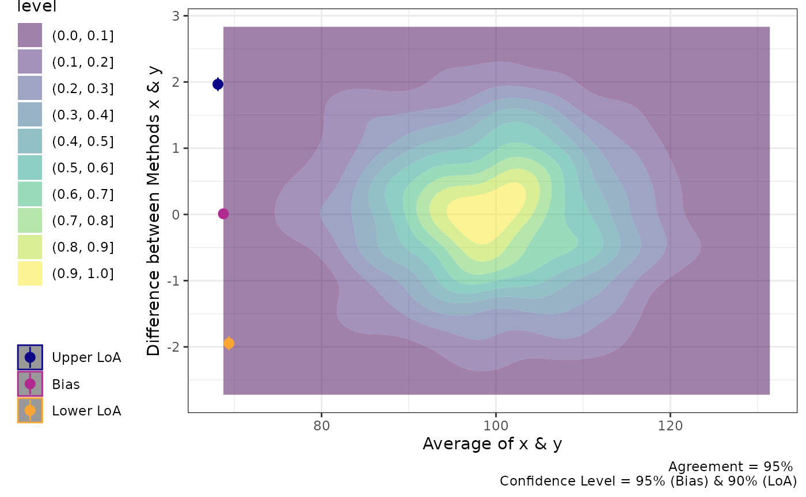

``` r

plot(a1,
     geom = "stat_density_2d")
```

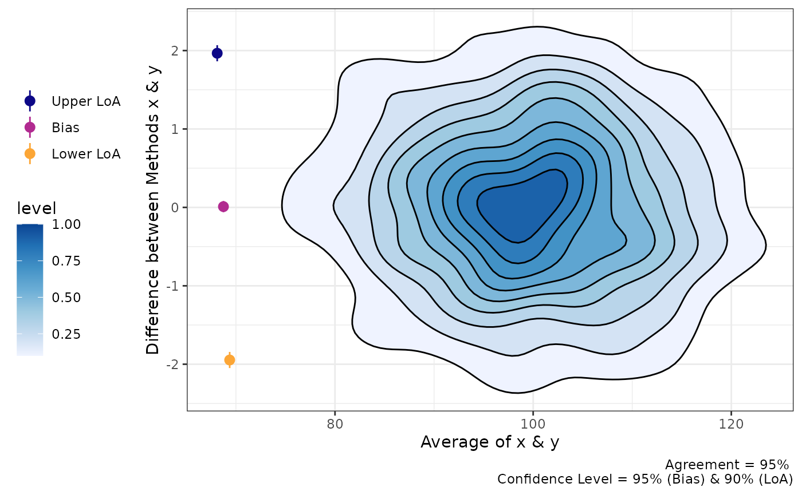

## Mixed Models

In some cases, the agreement calculations involve comparing two methods
within individuals within varying conditions. For example, the
“recpre_long” data set within this package contains two measurements of
rectal temperature in 3 different conditions (where there is a fixed
effect of condition). For this particular case we can use bootstrapping
to estimate the limits of agreement.

The `loa_lme` function can then calculate the limits of agreement. Like
the previous functions, the data set must be set with the `data`
argument. The `diff` is the column which contains the difference between
the two measurements. The `condition` is the column that indicates the
different conditions that the measurements were taken within. The `id`
is the column containing the subject/participant identifier. The final
two arguments `replicates` and `type` set the requirements for the
bootstrapping procedure. **Warning**: This is a computationally heavy
procedure and it may take a few seconds to a few minutes to complete
depending the number of replicates or if `het_var` is set to TRUE.

``` r

recpre_long$avg = (recpre_long$PM + recpre_long$PM)/2
a4 = loa_lme(data = recpre_long,
               diff = "diff",
               avg = "avg",
               #condition = "trial_condition",
               id = "id",
               #plot.xaxis = "AM",
               replicates = 199,
               type = "perc")
```

## References

Bland, J Martin, and Douglas G Altman. 1986. “Statistical Methods for
Assessing Agreement Between Two Methods of Clinical Measurement.” *The
Lancet* 327 (8476): 307–10.
<https://doi.org/10.1016/s0140-6736(86)90837-8>.

———. 1999. “Measuring Agreement in Method Comparison Studies.”
*Statistical Methods in Medical Research* 8 (2): 135–60.
<https://doi.org/10.1177/096228029900800204>.

Carrasco, Josep L., Tonya S. King, and Vernon M. Chinchilli. 2009. “The
Concordance Correlation Coefficient for Repeated Measures Estimated by
Variance Components.” *Journal of Biopharmaceutical Statistics* 19 (1):
90–105. <https://doi.org/10.1080/10543400802527890>.

King, Tonya S, Vernon M Chinchilli, and Josep L Carrasco. 2007. “A
Repeated Measures Concordance Correlation Coefficient.” *Statistics in
Medicine* 26 (16): 3095–3113. <https://doi.org/10.1002/sim.2778>.

Koenker, Roger. 2020. *Quantreg: Quantile Regression*.
<https://CRAN.R-project.org/package=quantreg>.

Lin, Lawrence I-Kuei. 1989. “A Concordance Correlation Coefficient to
Evaluate Reproducibility.” *Biometrics* 45 (1): 255.
<https://doi.org/10.2307/2532051>.

Shieh, Gwowen. 2019. “Assessing Agreement Between Two Methods of
Quantitative Measurements: Exact Test Procedure and Sample Size
Calculation.” *Statistics in Biopharmaceutical Research* 12 (3): 352–59.
<https://doi.org/10.1080/19466315.2019.1677495>.

Zou, GY. 2011. “Confidence Interval Estimation for the Blandaltman
Limits of Agreement with Multiple Observations Per Individual.”
*Statistical Methods in Medical Research* 22 (6): 630–42.
<https://doi.org/10.1177/0962280211402548>.
