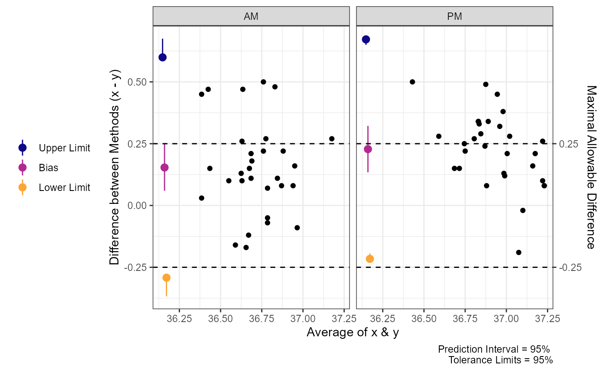
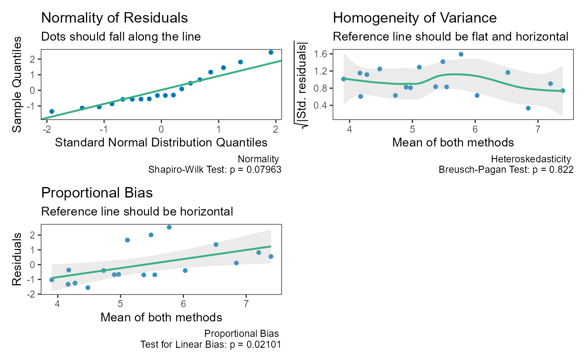
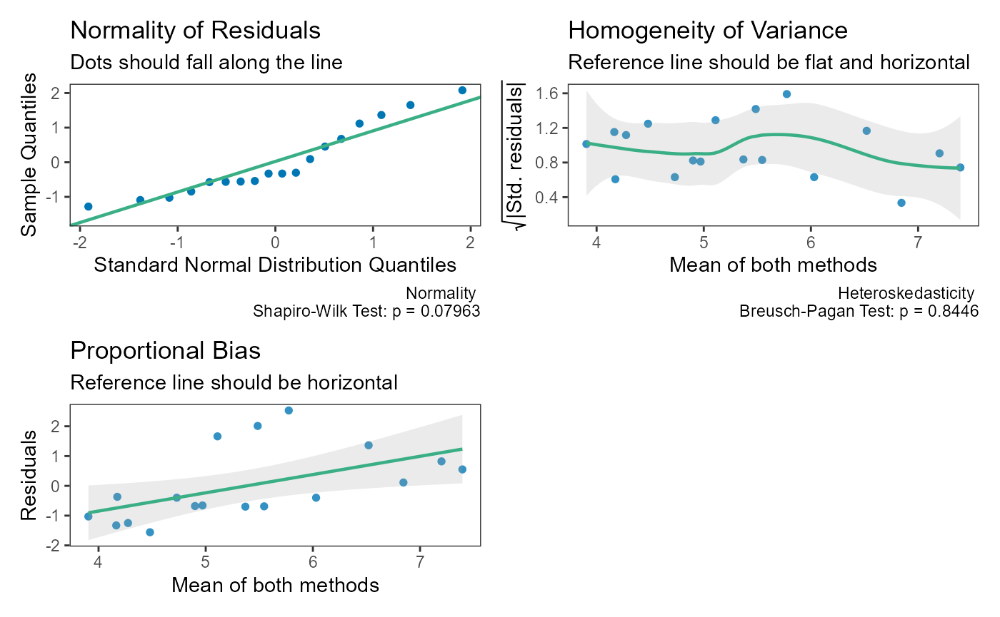
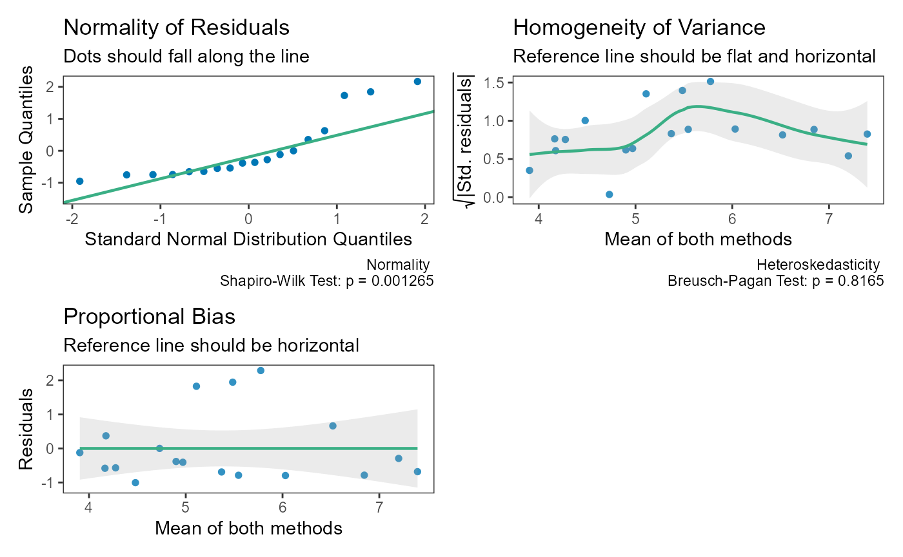
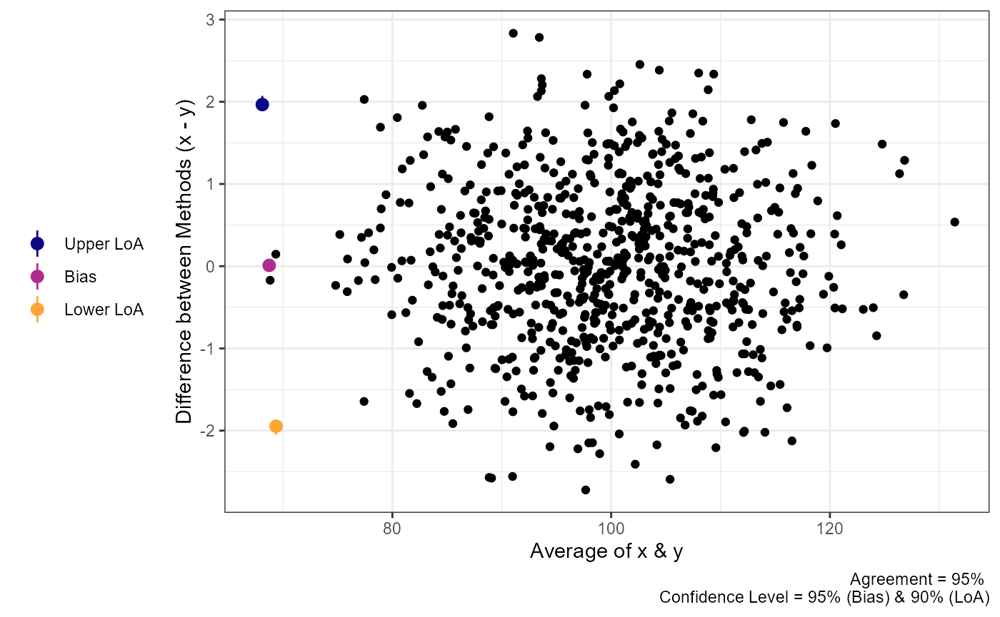
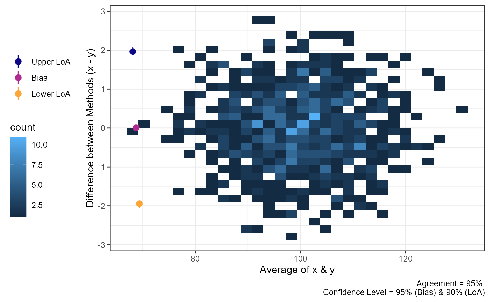
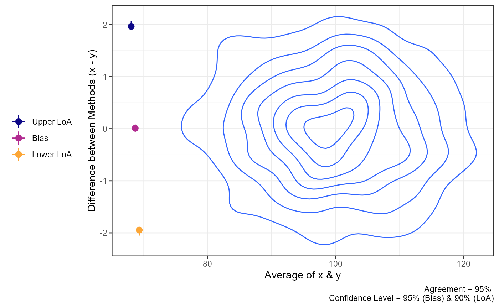
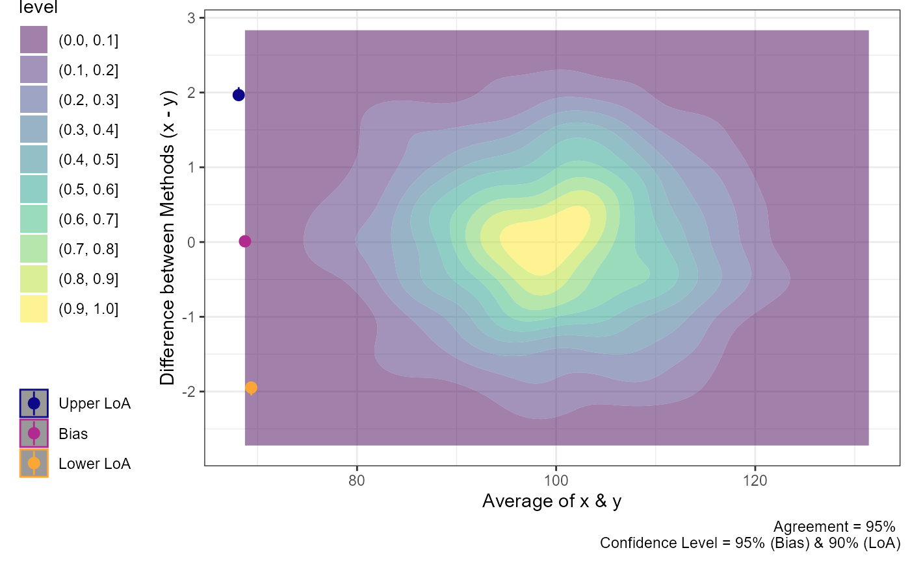
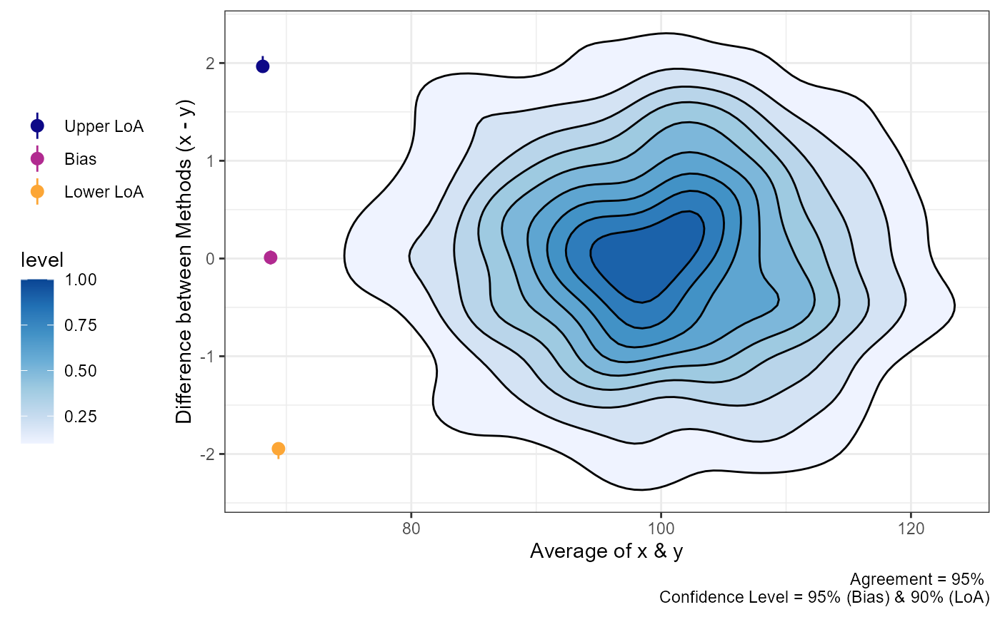

# Agreement & Tolerance Limits

In this vignette I will briefly demonstrate how `SimplyAgree` calculates
agreement and tolerance limits. This vignette assumes the reader has
some familiarity with “limits of agreement” (Bland-Altman limits) and is
familiar with the concept of prediction intervals. Please read the
references listed in this vignette *before* going further if you are not
familiar with both concepts.

``` r

library(SimplyAgree)
data(temps)
```

## Agree or Tolerate?

Francq et al. ([2020](#ref-francq2020tolerate)) pose this question in a
paper published in *Statistics in Medicine*. Traditionally, those
working in medicine or physiology have defaulted to calculating some
form of “limits of agreement” that Bland and Altman
([1986](#ref-bland1986)) recommended in their seminal paper. The
recommendation by Bland and Altman ([1986](#ref-bland1986)) was only an
approximation, and that has undergone many modifications (e.g., [Bland
and Altman 1999](#ref-bland1999); [Zou 2011](#ref-zou2011)) to improve
the accuracy of the agreement interval and their associated confidence
intervals. Meanwhile, the field of industrial statistics has focused on
calculating tolerance limits. There are R packages, such as the
`tolerance` R package available on CRAN, that are entirely dedicated to
calculating tolerance limits. It is important to note that tolerance is
not limited to the normal distribution and can be applied to other
distributions (please see the tolerance package by Young
([2010](#ref-young2010tolerance)) for more details). However, in the
agreement studies typically seen in medicine, tolerance limits may be a
more accurate way of determining whether two measurements are adequately
close to one another.

To quote Francq et al. ([2020](#ref-francq2020tolerate)):

> In terms of terminology, tolerance means, in this context, that some
> difference between the methods is tolerated (the measurements are
> still comparable in practice). Furthermore, the tolerance interval is
> exact and therefore more appropriate than the agreement interval.

In this package, tolerance limits refer to the “tolerance” associated
with the prediction interval for the difference between 2 measurements.
The calculative approach (detailed much further below) involves
calculating the prediction interval for the difference between two
methods (i.e., an estimate of an interval in which a future observation
will fall, with a certain probability, given what has already been
observed) and then calculating the confidence in the interval (i.e.,
tolerance). Therefore, if we want a 95% prediction interval with 95%
tolerance limits, the prediction interval is expected to contain 95% of
future observations, and the tolerance limits are an interval that, with
95% confidence, contains at least 95% of all differences (the default,
`bound_type = "joint"`; see [Joint versus Intersection-Union (IU)
Bounds](#joint-versus-intersection-union-iu-bounds) for the alternative
and when to use which).

Personally, I find the use of prediction intervals and tolerance limits
more attractive for 2 reasons: 1) the coverage of the prediction
intervals and their tolerance limits is often better than confidence
intervals for agreement limits, and 2) the interpretation of the
tolerance limits is much clearer. For a greater discussion of this
topic, please see the manuscript by Francq et al.
([2020](#ref-francq2020tolerate)) and check out their R package
`BivRegBLS`.

## Joint versus Intersection-Union (IU) Bounds

Both
[`agreement_limit()`](https://aaroncaldwell.us/SimplyAgree/reference/agreement_limit.md)
and
[`tolerance_limit()`](https://aaroncaldwell.us/SimplyAgree/reference/tolerance_limit.md)
report confidence bounds around the limits, and both have a `bound_type`
argument with the options `"joint"` and `"iu"`. The two options answer
different questions, so it is worth being clear about which one a
reported interval supports.

### Two questions

Suppose the two methods would be considered interchangeable if the
differences stay within a maximal allowable difference, \\\pm\Delta\\,
that was set in advance on clinical or practical grounds. Two different
questions can then be asked of the data:

1.  **“Where are the limits?”** We want an interval that we can report
    as a statement about the limits (or about the bulk of the
    differences), with a stated confidence.
2.  **“Can we conclude agreement within \\\pm\Delta\\?”** We want a
    hypothesis test, with a controlled error rate, of whether the
    differences stay within \\\pm\Delta\\.

A **joint** bound answers the first question: it is an interval, and the
confidence applies to the whole interval. An **intersection-union (IU)**
bound answers the second question: it gives the correctly sized test,
but the pair of bounds is not an interval with the stated confidence.

### Limits of agreement (`agreement_limit()`)

The limits of agreement estimate two parameters, the lower and upper
percentiles of the differences, \\\theta_L = \mu - z\sigma\\ and
\\\theta_U = \mu + z\sigma\\ (the 2.5th and 97.5th percentiles for 95%
limits of agreement). Each limit has its own sampling uncertainty, and
the “LoA CI” reports the outer confidence bound of each one: a lower
bound for \\\theta_L\\ and an upper bound for \\\theta_U\\.

- **`"joint"`**: each bound is the outer end of a two-sided \\1 -
  \alpha\\ confidence interval, so each side is a one-sided \\1 -
  \alpha/2\\ bound. By the Bonferroni inequality, both limits of
  agreement lie within the reported interval with at least \\1 -
  \alpha\\ confidence. This is the Bland-Altman convention, and the
  interval can be reported as “with 95% confidence, both limits of
  agreement lie within \[L, U\]”. Used as a test against \\\pm\Delta\\,
  the error rate is at most \\\alpha/2\\ (conservative).
- **`"iu"`**: each bound is a one-sided \\1 - \alpha\\ bound (the outer
  end of a two-sided \\1 - 2\alpha\\ interval, e.g., a 90% interval for
  \\\alpha = 0.05\\). Agreement within \\\pm\Delta\\ means that *both*
  \\\theta_L \> -\Delta\\ *and* \\\theta_U \< \Delta\\, so the null
  hypothesis of no agreement is the *union* \\H_0: \theta_L \le
  -\Delta\\ or \\\theta_U \ge \Delta\\. By the intersection-union
  principle ([Berger and Hsu 1996](#ref-berger1996)), rejecting only
  when each of the two one-sided tests rejects at level \\\alpha\\ gives
  an overall test with error rate at most \\\alpha\\, with no
  multiplicity adjustment. This is the same logic as the two one-sided
  tests (TOST) procedure for equivalence. The price is that the two
  bounds hold together only about \\1 - 2\alpha\\ of the time (about 90%
  for \\\alpha = 0.05\\), so they should not be reported as a 95%
  interval for the limits of agreement.

Because the IU bounds use a less extreme quantile on each side, the IU
bounds always lie inside the joint bounds for the limits of agreement. A
result near \\\pm\Delta\\ can therefore pass the IU test but not the
joint criterion.

### Tolerance limits (`tolerance_limit()`)

For tolerance limits, the two options target different quantities:

- **`"joint"`**: a “beta-content”, “gamma-confidence” tolerance
  interval: with confidence \\\gamma\\ (`tol_level`), at least a
  proportion \\\beta\\ (`pred_level`) of all differences lie within
  \\\[L, U\]\\. This is a single statement about the *coverage* of the
  interval, and it is how tolerance intervals are usually defined ([Howe
  1969](#ref-howe1969); [Francq et al. 2020](#ref-francq2020tolerate)).
  If \\\[L, U\]\\ lies within \\\pm\Delta\\, one can conclude at level
  \\1 - \gamma\\ that at least a proportion \\\beta\\ of the differences
  lie within \\\pm\Delta\\. The two tails do not need to be split
  equally: an interval with 1% of the differences below it and 4% above
  it still has 95% content.
- **`"iu"`**: a one-sided \\\gamma\\ confidence bound on each of the
  \\(1 \mp \beta)/2\\ percentiles of the differences, i.e., on the
  limits of agreement. These target the same quantities as the
  [`agreement_limit()`](https://aaroncaldwell.us/SimplyAgree/reference/agreement_limit.md)
  bounds, and the test against \\\pm\Delta\\ has the same
  intersection-union interpretation.

Unlike the limits of agreement, the two kinds of tolerance limits **do
not nest**, because they test different hypotheses: the joint limits
bound the total proportion of differences outside \\\[L, U\]\\, while
the IU bounds control each tail separately. For example, with 30
independent differences and \\\beta = \gamma = 0.95\\, the multipliers
of the standard deviation are:

| Interval                                                     | Multiplier |
|--------------------------------------------------------------|------------|
| Plug-in limits of agreement (no uncertainty), \\z\_{0.975}\\ | 1.960      |
| Joint (\\\beta\\-content, Howe)                              | 2.550      |
| IU (one-sided 95% bound on each percentile)                  | 2.608      |
| Equal-tailed joint (Bonferroni, 97.5% per side)              | 2.757      |

so the IU tolerance bounds are slightly *wider* than the joint tolerance
limits here. A skewed distribution of differences can also pass one
criterion and fail the other. The choice between them is therefore about
the hypothesis of interest (coverage, or each tail), not only about how
conservative the result is.

### Why the defaults differ

The defaults follow what each function is for:

- **[`agreement_limit()`](https://aaroncaldwell.us/SimplyAgree/reference/agreement_limit.md)
  defaults to `"iu"`.** The confidence bounds on the limits of agreement
  are used to decide whether the limits fall within \\\pm\Delta\\. That
  is an intersection-union question, and the IU bounds give a test with
  the stated error rate \\\alpha\\; the joint bounds would be
  conservative (error rate \\\alpha/2\\). This is also what
  [`agreement_limit()`](https://aaroncaldwell.us/SimplyAgree/reference/agreement_limit.md)
  has always computed, so the default does not change earlier results.
  Use `bound_type = "joint"` when the interval itself is to be reported.
- **[`tolerance_limit()`](https://aaroncaldwell.us/SimplyAgree/reference/tolerance_limit.md)
  defaults to `"joint"`.** A tolerance interval is itself a reportable
  statement (“with 95% confidence, at least 95% of the differences lie
  within \[L, U\]”), and the \\\beta\\-content interval is what the
  tolerance interval literature, and the approximation of Francq et al.
  ([2020](#ref-francq2020tolerate)), refer to. The IU version duplicates
  the confidence bounds of
  [`agreement_limit()`](https://aaroncaldwell.us/SimplyAgree/reference/agreement_limit.md),
  so it is offered as an option rather than the default.

### What to report

- State which kind of bound is reported, and at what level. The printed
  output of both functions does this.
- To *report* an interval: use the joint bounds
  (`agreement_limit(bound_type = "joint")` or the default tolerance
  limits).
- To *test* agreement within \\\pm\Delta\\: compare either the IU bounds
  of the limits of agreement (the default of
  [`agreement_limit()`](https://aaroncaldwell.us/SimplyAgree/reference/agreement_limit.md))
  or the joint tolerance limits against \\\pm\Delta\\, depending on
  whether the hypothesis concerns each tail or the overall proportion of
  differences, and state which was used.
- Remember, IU bounds limits of agreement are one-tailed confidence
  intervals.

## Tolerance

In `SimplyAgree` we utilize a generalized least square (GLS) model to
estimate the prediction interval and tolerance limits. The function uses
the `gls` function from the `nlme` R package to build the model. This
allows a *very* flexible approach for estimating prediction intervals
and tolerance limits.

We can use the `tolerance_limits` function demonstrate the basic
calculations. In this example (below), we use the `temps` data set to
measure the differences between esophageal and rectal temperatures
between different times of day (`tod`) and controlling for the
intra-subject correlation.

``` r

tolerance_limit(
  data = temps,
  x = "trec_pre", # First measure
  y = "teso_pre", # Second measure
  id = "id", # Subject ID
  condition = "tod", # Identify condition that may affect differences
  cor_type = "sym" # Set correlation structure as Compound Symmetry
)
#> Agreement between Measures (Difference: x-y)
#> 95% CI for Bias; 95% Prediction Interval
#> Tolerance Limits: at least 95% of differences with 95% confidence
#> Model: GLS, compound symmetry within id; residual SD by condition
#> 
#>  Condition   Bias          Bias CI Prediction Interval  Tolerance Limits
#>         AM 0.1537 [0.0595, 0.2478]   [-0.2919, 0.5993] [-0.3674, 0.6748]
#>         PM 0.2280 [0.1342, 0.3218]     [-0.216, 0.672] [-0.1938, 0.6498]
```

### Calculative Approach

This section describes how
[`tolerance_limit()`](https://aaroncaldwell.us/SimplyAgree/reference/tolerance_limit.md)
computes each interval. The model is fit with the `nlme` package
(Pinheiro & Bates)[^1], which, unlike the models used for the limits of
agreement below, accommodates correlated errors and unequal variances.

#### Notation

- \\d\\ is the difference between the two measurements (`x - y`), and
  \\b\\ is its estimated mean (the bias, the estimated marginal mean
  from `emmeans`) for a given row of the output (a condition and/or a
  value of the average when `prop_bias = TRUE`).
- \\\beta\\ = `pred_level` is the content, the proportion of differences
  the limits should cover, and \\\alpha_1 = 1 - \beta\\.
- \\\gamma\\ = `tol_level` is the confidence of the tolerance limits,
  and \\\alpha_2 = 1 - \gamma\\.
- \\z = z\_{1 - \alpha_1/2}\\, the standard normal quantile (1.96 for
  \\\beta = 0.95\\).
- \\\chi^2\_{p, \nu}\\ is the \\p\\ quantile of a chi-square
  distribution with \\\nu\\ degrees of freedom, and \\t\_{p, \nu}\\ the
  \\p\\ quantile of a \\t\\ distribution.
- With repeated measures, every interval refers to **a single new
  difference from a new subject**: its variance includes the
  between-subject and within-subject variance.

#### Arguments Influencing the Model

The only required arguments are `x`, `y`, and `data`, which give the
data frame and the columns that contain the two measurements.

- `id` identifies the subjects (or other clusters) within which
  differences are correlated. With `model = "lme"`, it can name two
  nested levels, outer level first (e.g., `id = c("golfer", "club")`).
- `time` gives the order of the measurements within a subject, for the
  autoregressive correlation structures.
- `condition` identifies a factor that may change the mean and the
  variance of the differences; it adds a separate mean and a separate
  residual variance for each condition.
- `prop_bias = TRUE` adds the average of the two measurements as a
  covariate, and the limits are reported at its minimum, median, and
  maximum.
- `model` and `cor_type` set the model for the correlation between
  differences from the same subject (below).
- `weights` and `correlation` let you specify an `nlme` variance
  function or correlation structure directly.

#### The model

With `model = "gls"` (default), the differences follow a marginal
generalized least squares model
([`nlme::gls()`](https://rdrr.io/pkg/nlme/man/gls.html)):

\\ d\_{ij} = \mathbf{x}\_{ij}^\top \boldsymbol{\beta} + e\_{ij}, \qquad
\text{Var}(e\_{ij}) = \sigma^2 g\_{ij}^2, \qquad \text{Cor}(e\_{ij},
e\_{ij'}) = R\_{i, jj'} \\

where \\g\_{ij}\\ is the variance function (1 without one) and \\R_i\\
is the correlation matrix for subject \\i\\: compound symmetry
(`cor_type = "sym"`, a common correlation \\\rho\\), AR(1) or continuous
AR(1) (`"ar1"`, `"car1"`), or none. The variance of a single difference
for a given row of the output is \\S^2 = \hat\sigma^2 g^2\\.

With `model = "lme"`, the differences follow a linear mixed model
([`nlme::lme()`](https://rdrr.io/pkg/nlme/man/lme.html)) with a random
intercept for each subject and, optionally, for each setting (inner
level) within subject:

\\ d\_{ijk} = \mathbf{x}\_{ijk}^\top \boldsymbol{\beta} + u_i +
v\_{ij} + e\_{ijk}, \qquad u_i \sim N(0, \sigma_1^2), \quad v\_{ij} \sim
N(0, \sigma_2^2), \quad \text{Var}(e\_{ijk}) = \sigma^2 g\_{ijk}^2 \\

where \\v\_{ij}\\ is present only with two `id` columns, the variance
function applies to the residuals only, and `cor_type = "ar1"` or
`"car1"` adds serial correlation of the residuals within the innermost
level. The variance of a single difference for a given row is

\\ S^2 = \hat\sigma_1^2 + \hat\sigma_2^2 + \hat\sigma^2 g^2 . \\

The output reports the components as `SD.between` (\\\hat\sigma_1\\),
`SD.nested` (\\\hat\sigma_2\\), and `SD.within` (\\\hat\sigma g\\). For
`gls` with compound symmetry, `SD.between` \\= \sqrt{\hat\rho}\\ S\\ and
`SD.within` \\= \sqrt{1 - \hat\rho}\\ S\\.

#### The bias and its standard error

The bias \\b\\ for each row and its standard error (SEM) are the
estimated marginal mean and its standard error from `emmeans`. The
confidence interval for the bias is \\b \pm t\_{1 - (1 - c)/2,\\ df_b}
\cdot SEM\\, where \\c\\ is `conf_level`. The degrees of freedom
\\df_b\\ are:

- `model = "gls"`: the approximation of Satterthwaite
  ([1946](#ref-satterthwaite1946)) (see Kuznetsova et al.
  ([2017](#ref-lmertest)) for its implementation in R).
- `model = "lme"`: the “containment” degrees of freedom, which are the
  number of subjects minus 1 for the models fit here. The Satterthwaite
  approximation for `lme` models in `emmeans` can fail (for a model with
  only an intercept) or not terminate (with a variance function), so it
  is not used.

#### Prediction interval

The standard error of prediction (SEP) combines the uncertainty in the
bias with the variance of a single difference:

\\ SEP = \sqrt{SEM^2 + S^2} \\

and the prediction interval is

\\ PI = b \pm t\_{1-\alpha_1/2,\\ df_b} \cdot SEP . \\

This is a “beta-expectation” tolerance interval: on average over
repeated studies, it contains a proportion \\\beta\\ of the differences.
It is not a confidence statement.

#### Upper confidence bound for the SD

Both kinds of tolerance limits need a one-sided upper confidence bound
\\S_U\\, at level \\\gamma\\, for the SD of a single difference. The
difficulty with repeated measures is that \\S^2\\ is a sum of variance
components that are estimated with very different amounts of
information: the between-subject variance with only (subjects \\- 1\\)
degrees of freedom, and the within-subject variance with many more. A
single chi-square distribution with a single “effective” degrees of
freedom misses the skewness of the between-subject part and gives limits
that are too narrow (coverage of about 91% for a 95% target in our
simulations). Instead, \\S^2\\ is split into pieces, each with its own
degrees of freedom, and the pieces are combined with the MOVER method
([Zou 2011](#ref-zou2011); [Donner and Zou
2012](#ref-donner2012closed)), as for the nested limits of agreement
further below.

**Independent data** (`gls` without `id`, or with `cor_type = "none"`):
with \\\nu\\ the residual degrees of freedom (\\N - p\\ without a
variance function),

\\ S_U = S \sqrt{\frac{\nu}{\chi^2\_{\alpha_2, \nu}}} . \\

**Variance components** (`gls` with compound symmetry, or `lme`): write
\\S^2 = \sum_j a_j\\, where piece \\j\\ is estimated with \\\nu_j\\
degrees of freedom. Then

\\ S_U^2 = S^2 + \sqrt{\sum_j \left\[ a_j \left(
\frac{\nu_j}{\chi^2\_{\alpha_2, \nu_j}} - 1 \right) \right\]^2 } . \\

Pieces with zero degrees of freedom are dropped. The pieces are the
balanced nested analysis of variance decomposition of \\S^2\\ into the
variance of a subject mean and the remaining within-subject variation,
generalized to unbalanced data and to residual correlation:

| Model | Piece | \\a_j\\ | \\\nu_j\\ |
|----|----|----|----|
| `gls`, compound symmetry | subject mean | \\\left(\hat\rho + \dfrac{1 - \hat\rho}{m_h}\right) S^2\\ | \\n - 1\\ |
|  | within subject | \\S^2 - a_1\\ | \\N - n\\ |
| `lme` | subject mean | \\\hat\sigma_1^2 + \tau\\ \hat\sigma_2^2 + \kappa\_{s}\\ \hat\sigma_e^2\\ | \\n - 1\\ |
|  | setting within subject | \\(1 - \tau)\\ \hat\sigma_2^2 + (\kappa\_{c} - \kappa\_{s})\\ \hat\sigma_e^2\\ | \\n_c - n\\ |
|  | within setting | \\(1 - \kappa\_{c})\\ \hat\sigma_e^2\\ | \\N - n_c\\ |

where:

- \\n\\ is the number of subjects, \\n_c\\ the number of settings (the
  inner level; \\n_c = n\\ without nesting, so the middle piece is
  empty), and \\N\\ the number of measurements.
- \\\hat\sigma_e^2 = \hat\sigma^2 g^2\\ is the residual variance for the
  row, and \\\hat\rho\\ is the compound symmetry correlation (truncated
  at 0).
- \\m_h = n / \sum_i m_i^{-1}\\ is the harmonic mean number of
  measurements per subject (\\m_i\\ for subject \\i\\).
- \\\kappa_s = \frac{1}{n} \sum_i \mathbf{1}^\top R_i \mathbf{1} /
  m_i^2\\ is the residual variance of a subject mean relative to that of
  one measurement, averaged over subjects, and \\\kappa_c\\ is the same
  for setting means. Without residual correlation, \\\kappa_s\\ is the
  mean of \\1/m_i\\ (so \\\kappa_s = 1/m_h\\) and \\\kappa_c\\ the mean
  of \\1/m_c\\; with AR(1) residuals, \\\mathbf{1}^\top R_i \mathbf{1}\\
  adds the correlations between measurements.
- \\\tau = \frac{1}{n} \sum_i \sum_c m\_{ic}^2 / m_i^2\\ is the share of
  the setting variance in the variance of a subject mean (\\1/s\\ with
  \\s\\ settings of equal size).

For balanced data without residual correlation, these are exactly the
pieces of the classical decomposition \\S^2 = MS_A / (sk) + MS_B (1/k -
1/(sk)) + MS_W (1 - 1/k)\\ for \\n\\ subjects, \\s\\ settings per
subject, and \\k\\ measurements per setting.

When `condition` is supplied, each condition has its own residual
variance, and each condition’s variance components are estimated from
the measurements in that condition. The counts (\\n\\, \\n_c\\, \\N\\,
\\m_i\\, \\m_h\\) and \\\kappa\\, \\\tau\\ are then computed from the
rows of that condition only. (Using the counts of the whole data set
gave limits that were too narrow: about 93% coverage for a 95% target.)

**Other correlation structures** (`gls` with AR(1), continuous AR(1), or
a user-specified structure): \\S_U = S \sqrt{\nu / \chi^2\_{\alpha_2,
\nu}}\\ with an effective degrees of freedom

\\ \nu = \frac{2 S^4}{\widehat{\text{Var}}(S^2)}, \\

where \\\widehat{\text{Var}}(S^2)\\ comes from the delta method applied
to the approximate covariance matrix of the variance parameters (\\\log
\hat\sigma\\ and the variance function parameters) that `nlme` computes
(`apVar`). If that matrix is not available, \\df_b\\ is used instead,
with a warning.

The output reports \\S_U\\ as `SD.upper` and the degrees of freedom of
\\S^2\\ as `SD.df` (for the variance components, the Satterthwaite value
\\S^4 / \sum_j a_j^2 / \nu_j\\, reported for information only).

#### Tolerance limits: `bound_type = "joint"`

See [Joint versus Intersection-Union (IU)
Bounds](#joint-versus-intersection-union-iu-bounds) for when to use the
joint or the IU limits.

The joint tolerance limits are a “beta-content”, “gamma-confidence”
tolerance interval: with confidence \\\gamma\\, at least a proportion
\\\beta\\ of all differences lie within the limits. They use the
approximation of Howe ([1969](#ref-howe1969)), as described by Francq et
al. ([2020](#ref-francq2020tolerate)):

\\ TI = b \pm z \cdot SEP \cdot \frac{S_U}{S} . \\

For independent data with only an intercept, \\SEP = S \sqrt{1 + 1/n}\\
and \\S_U / S = \sqrt{(n-1)/\chi^2\_{\alpha_2, n-1}}\\, and this is
exactly Howe’s tolerance factor. If the limits lie within a maximal
allowable difference \\\pm\Delta\\, one can conclude, at level
\\\alpha_2\\, that at least a proportion \\\beta\\ of the differences
lie within \\\pm\Delta\\. The tails do not need to be split equally.

#### Tolerance limits: `bound_type = "iu"`

The “iu” limits are one-sided \\\gamma\\ confidence bounds on each of
the two limits of agreement, \\\theta_L = \mu - z\sigma\\ and \\\theta_U
= \mu + z\sigma\\ (the \\(1 \mp \beta)/2\\ percentiles of the
differences). If both bounds lie within \\\pm\Delta\\, one can reject,
at level \\\alpha_2\\, that either limit of agreement lies outside
\\\pm\Delta\\ (an intersection-union test). The two bounds hold together
only about \\1 - 2\alpha_2\\ of the time, so they are not a joint
\\\gamma\\ interval.

**Independent data** (`gls` without a correlation structure): the bounds
are exact, from the noncentral \\t\\ distribution,

\\ b \mp t'\_{\gamma,\\ \nu}\\\left(\frac{zS}{SEM}\right) SEM , \\

where \\t'\_{\gamma, \nu}(\lambda)\\ is the \\\gamma\\ quantile of a
noncentral \\t\\ distribution with \\\nu\\ degrees of freedom and
noncentrality \\\lambda\\. (When \\\lambda \> 37\\, where the noncentral
\\t\\ quantile is numerically unreliable, the MOVER bound below is
used.)

**Otherwise**, the MOVER bound ([Zou 2011](#ref-zou2011)) combines the
one-sided bounds for the bias and for \\S\\:

\\ L = (b - zS) - \sqrt{\left(t\_{\gamma,\\ df_b}\\ SEM\right)^2 + z^2
\left(S_U - S\right)^2}, \qquad U = (b + zS) + \sqrt{\left(t\_{\gamma,\\
df_b}\\ SEM\right)^2 + z^2 \left(S_U - S\right)^2} . \\

#### Bootstrap calibration: `tol_method = "boot_cal"` (experimental)

The bootstrap calibrates the nominal confidence level of the analytic
limits ([Loh 1987](#ref-loh1987); [Beran 1987](#ref-beran1987)):

1.  **Simulate** \\B\\ (`replicates`) new data sets from the fitted
    model, using the point estimates: \\\mathbf{d}^\* =
    \mathbf{X}\hat{\boldsymbol\beta} + \mathbf{e}^\*\\, where
    \\\mathbf{e}^\*\\ has the fitted marginal covariance. For subject
    \\i\\ this is \\D_i R_i D_i\\ for `gls` and \\\hat\sigma_1^2 J +
    \hat\sigma_2^2 B_i + D_i R_i D_i\\ for `lme`, where \\D_i\\ holds
    the residual SDs, \\J\\ is a matrix of ones, and \\B_i\\ has ones
    for pairs of measurements in the same setting.
2.  **Refit** the model to each data set, and compute the replicate bias
    \\b^\*\\, SD \\S^\*\\, SEM\\^\*\\, and variance components (or
    effective degrees of freedom). Replicates whose model fails to
    converge are dropped, with a warning if more than 5% fail.
3.  **Calibrate.** For a nominal level \\\lambda\\, compute the analytic
    limits \\L^\*(\lambda)\\ and \\U^\*(\lambda)\\ in each replicate
    (reusing \\df_b\\ from the original fit). The fitted model plays the
    role of the truth, with differences distributed as \\N(b, S^2)\\.
    - `"joint"`: the coverage at level \\\lambda\\ is \\C(\lambda) =
      \frac{1}{B} \sum \mathbb{1}\left\\ \Phi\\\left(\frac{U^\* -
      b}{S}\right) - \Phi\\\left(\frac{L^\* - b}{S}\right) \ge \beta
      \right\\\\.
    - `"iu"`: separately for each bound, \\C_L(\lambda) = \frac{1}{B}
      \sum \mathbb{1}\\L^\*(\lambda) \le b - zS\\\\ and \\C_U(\lambda) =
      \frac{1}{B} \sum \mathbb{1}\\U^\*(\lambda) \ge b + zS\\\\.

    The calibrated level \\\hat\lambda\\ is the smallest \\\lambda \in
    \[0.5, 1)\\ with coverage of at least \\\gamma\\ (found by
    bisection).
4.  **Report** the analytic limits for the observed data at the
    calibrated level(s), which are returned as `lower.TL.level` and
    `upper.TL.level`.

Because the replicates are simulated from the estimated variance
components as if they were known, the calibration has its own error when
there are few subjects: in our simulations with 10 to 15 subjects, its
coverage ranged from about 93% to 96% for a 95% target, while the
analytic limits were 95% to 96.5% in the same settings. The analytic
limits are therefore recommended, and the bootstrap may be useful as a
check for models whose analytic limits have not been evaluated (e.g.,
other variance functions or proportional bias).

#### Summary of the degrees of freedom

| Quantity | Model | Degrees of freedom |
|----|----|----|
| Bias CI and prediction interval (\\df_b\\) | `gls` | Satterthwaite (`emmeans`) |
|  | `lme` | Containment: subjects \\- 1\\ |
| \\S_U\\, independent data | `gls`, no correlation | \\N - p\\ (with a variance function: effective df, below) |
| \\S_U\\, variance components | `gls` compound symmetry; `lme` | subject mean: \\n - 1\\; setting within subject: \\n_c - n\\; within: \\N - n_c\\ (per condition when `condition` is supplied) |
| \\S_U\\, other structures | `gls` AR(1), CAR(1), user structure, or a variance function without correlation | effective df \\2S^4 / \widehat{\text{Var}}(S^2)\\ from `apVar` (fallback: \\df_b\\) |
| “iu” noncentral \\t\\ | independent data | \\\nu\\ as for \\S_U\\ |
| “iu” MOVER bound for the bias | all others | \\df_b\\ |
| `SD.df` (reported) | variance components | Satterthwaite, \\S^4 / \sum_j a_j^2 / \nu_j\\ |

#### Coverage in simulations

The table summarizes the coverage of the analytic limits in our
simulations (95% content and 95% confidence; 1,000 simulated data sets
each, so the Monte Carlo standard error is about 0.7 percentage points).
The full record, with the scripts, is kept in the package’s source
repository (`references/general/tolerance_simulations`).

| Design | Model | Joint | IU (lower / upper) |
|----|----|----|----|
| 20 subjects × 19, compound symmetry | `gls`, `"sym"` | 0.957 | 0.940 / 0.958 |
| 10 subjects × 5, compound symmetry | `gls`, `"sym"` | 0.954 | 0.950 / 0.948 |
| 15 × 8, AR(1), no subject effect | `gls`, `"ar1"` | 0.950 | 0.951 / 0.952 |
| 15 × 8, subject effect + AR(1) | `gls`, `"ar1"` | 0.893 | 0.895 / 0.916 |
| 15 × 8, subject effect + AR(1) | `lme`, `"ar1"` | 0.949 | 0.939 / 0.957 |
| 12 × 8, condition-specific residual SD | `gls`, `condition` | 0.965 | 0.958 / 0.963 |
| 12 × 8, common subject effect, condition-specific residual SD | `lme`, `condition` | 0.971 | 0.969 / 0.965 |
| 15 subjects, 2–4 settings each (nested) | `lme`, nested `id` | 0.963 | 0.948 / 0.954 |
| 15 subjects, 2–4 settings each (nested) | `lme`, inner level as `id` | 0.883 | 0.855 / 0.890 |

#### Model assumptions

A few modelling choices deserve attention (see the “Model assumptions”
section of
[`?tolerance_limit`](https://aaroncaldwell.us/SimplyAgree/reference/tolerance_limit.md)
for details):

- With the default marginal model (`model = "gls"`), the autoregressive
  correlation structures (`cor_type = "ar1"` or `"car1"`) have no
  persistent subject effect and the correlation between measurements
  from the same subject decays towards zero over time. If subjects have
  a persistent bias of their own, these structures understate the
  uncertainty in the bias and give limits that are too narrow. Setting
  `model = "lme"` fits a random intercept for each subject and adds the
  serial correlation to the residuals, which keeps the persistent
  subject effect (see the simulations above).
- With `model = "gls"`, compound symmetry, and a variance function
  (e.g., from `condition`), the between-subject variance scales with the
  residual standard deviation of each condition. With `model = "lme"`,
  the variance function applies to the residuals only, and the
  between-subject variance is shared across conditions.
- With `model = "lme"`, `id` can name two nested levels, outer level
  first (e.g., `id = c("golfer", "club")` for shots with several clubs
  per golfer). Avoid setting `id` to the inner level alone (e.g., a
  golfer-by-club identifier): that drops the correlation across clubs
  within a golfer and gives limits that are too narrow. More than two
  levels are not supported.
- A slope of the differences on the average (`prop_bias = TRUE`) can
  appear without any true proportional bias when the two methods have
  unequal measurement error variances ([Bland and Altman
  1999](#ref-bland1999)).

For example, a random intercept model with serial correlation of the
residuals, and one with nested random intercepts:

``` r

# random intercept for each subject, plus AR(1) correlation of the residuals
tolerance_limit(
  data = temps,
  x = "trec_pre",
  y = "teso_pre",
  id = "id",
  time = "trial_num",
  model = "lme",
  cor_type = "ar1"
)

# nested random intercepts: clubs within golfers
tolerance_limit(
  data = golf, # a data set with columns golfer, club, x, and y
  x = "x",
  y = "y",
  id = c("golfer", "club"),
  model = "lme"
)
```

### Example

In the `temps` data we have different measures of core temperature at
varying times of day. Let us assume we want to measure pre-exercise
agreement between esophageal and rectal temperature while controlling
for time of day (`tod`).

``` r

test1 = tolerance_limit(data = temps,
                        x = "teso_pre",
                        y = "trec_pre",
                        id = "id",
                        condition = "tod")

test1
#> Agreement between Measures (Difference: x-y)
#> 95% CI for Bias; 95% Prediction Interval
#> Tolerance Limits: at least 95% of differences with 95% confidence
#> Model: GLS, compound symmetry within id; residual SD by condition
#> 
#>  Condition    Bias            Bias CI Prediction Interval  Tolerance Limits
#>         AM -0.1537 [-0.2478, -0.0595]   [-0.5993, 0.2919] [-0.6748, 0.3674]
#>         PM -0.2280 [-0.3218, -0.1342]     [-0.672, 0.216] [-0.6498, 0.1938]
```

## Agreement

The agreement limit calculations in `SimplyAgree` are a tad more
constrained than the tolerance limit. There are only 3 types of
calculations that can be made: simple, replicate, and nested. The simple
calculation each pair of observations (x and y) are *independent*;
meaning that each pair represents one subject/participant. Sometimes
there are multiple measurements taken within subjects when comparing two
measurements tools. In some cases the true underlying value will not be
expected to vary (i.e., replicates or “reps”), or multiple measurements
may be taken within an individual *and* these values are expected to
vary (i.e., nested).

The `agreement_limit` function, unlike the other agreement functions in
the package (i.e., `agree_test`, `agree_reps`, and `agree_nest`), allows
users to make any of the three calculations all-in-one function.
Further, `agreement_limit` reports only the outer confidence bound of
each limit of agreement (a lower bound for the lower limit and an upper
bound for the upper limit), because those are the bounds that matter
when comparing the limits against a maximal allowable difference. By
default (`bound_type = "iu"`), each is a one-sided \\1 - \alpha\\ bound,
which gives an intersection-union test of agreement at level \\\alpha\\;
with `bound_type = "joint"`, each is a one-sided \\1 - \alpha/2\\ bound,
and both limits of agreement lie within the reported interval with at
least \\1 - \alpha\\ confidence (see [Joint versus Intersection-Union
(IU) Bounds](#joint-versus-intersection-union-iu-bounds)).

### Arguments Influencing the LoA Calculations

Users of the this function have a number of options. The only required
arguments are `x`, `y`, and `data` which dictate the data frame, and the
columns that contain the 2 measurements. The `id` argument, when
specified, identifies the column that contains the subject identifier.
This is only necessary if it is a replicate or nested design. The type
of design is dictated by `data_type` argument. Additionally, the
`loa_calc` function dictates how the limits of agreement are calculated.
Users have the option of computing Bland and Altman
([1999](#ref-bland1999)) or MOVER ([Zou 2011](#ref-zou2011); [Donner and
Zou 2012](#ref-donner2012closed)) limits of agreement (calculations
detailed below). I strongly recommend utilizing the MOVER limits of
agreement over the Bland-Altman limits ([Zou 2011](#ref-zou2011);
[Donner and Zou 2012](#ref-donner2012closed)) as it is the more
conservative of the two options. The `bound_type` argument sets what the
confidence bounds of the limits of agreement claim (see [Joint versus
Intersection-Union (IU)
Bounds](#joint-versus-intersection-union-iu-bounds)).

**NOTE**: in the formulas for the confidence bounds of the limits of
agreement below, \\\alpha\\ denotes the one-sided level used for each
bound: \\\alpha\\ = `alpha` for `bound_type = "iu"` (default) and
\\\alpha\\ = `alpha`/2 for `bound_type = "joint"`. The confidence
interval for the bias is always a two-sided \\1 -\\ `alpha` interval.

### Simple Agreement

In the simplest scenario, a study may be conducted to compare one
measure (e.g., `x`) and another (e.g., `y`). In this scenario each pair
of observations (x and y) are *independent*; that means that each pair
represents one subject/participant that is uncorrelated with other
pairs.

The data for the two measurements are put into the `x` and `y`
arguments.

``` r

# Calc. LoA
a1 = agreement_limit(data = reps,
                     x = "x",
                     y = "y")
# print
a1
#> MOVER Limits of Agreement (LoA)
#> 95% LoA @ 5% Alpha-Level
#> Independent Data Points
#> 
#>    Bias           Bias CI Lower LoA Upper LoA            LoA CI
#>  0.4383 [-0.1669, 1.0436]    -1.947     2.824 [-3.0117, 3.8884]
#> 
#> LoA CI: one-sided 95% bounds (outer ends of 90% CIs) for an intersection-union test against a maximal allowable difference;
#>   not a joint 95% interval for the LoA
#> SD of Differences = 1.217
```

#### Calculation Steps

The reported limits of agreement are derived from the work of Bland and
Altman ([1986](#ref-bland1986)) and Bland and Altman
([1999](#ref-bland1999)). Throughout, \\z_A = z\_{1-(1-agree)/2}\\ is
the normal quantile for the agreement level (1.96 for the default of
95%), and \\z\_{1-\alpha}\\ and \\t\_{1-\alpha, df}\\ use the one-sided
level \\\alpha\\ for each confidence bound (see the note above).

**LoA**

\\ LoA = \bar d \pm z_A \cdot S_d \\

wherein \\\bar d\\ is the mean of the \\N\\ differences and \\S_d\\ is
their standard deviation.

**Confidence Interval**

1.  Calculate the standard error of the LoA

\\ S\_{LoA} = S_d \cdot \sqrt{\frac{1}{N}+ \frac{z^2_A}{2 \cdot(N-1)} }
\\

2.  Calculate the limit of agreement margin of error (LME)

**Bland-Altman Method**

\\ LME = t\_{1 - \alpha, \\ N-1} \cdot S\_{LoA} \\

**MOVER Method**

\\ LME = S_d \cdot \sqrt{\frac{z\_{1-\alpha}^2}{N} + z^2_A \cdot
\left(\sqrt{\frac{N-1}{\chi^2\_{\alpha, N-1}}}-1\right)^2} \\

where \\\chi^2\_{\alpha, N-1}\\ is the lower \\\alpha\\ quantile of the
chi-square distribution.

3.  Calculate Confidence Interval

\\ Lower \space LoA \space C.I. = Lower \space LoA - LME \\

\\ Upper \space LoA \space C.I. = Upper \space LoA + LME \\

### Repeated Measures Agreement

In many cases there are multiple measurements taken within subjects when
comparing two measurements tools. In some cases the true underlying
value will not be expected to vary (i.e., `data_type = "reps"`), or
multiple measurements may be taken within an individual *and* these
values are expected to vary (i.e., `data_type = "nest"`).

### Replicates

This limit of agreement type is for cases where the underlying values do
*not* vary within subjects. This can be considered cases where replicate
measure may be taken. For example, a researcher may want to compare the
performance of two ELISA assays where measurements are taken in
duplicate/triplicate.

So, you will have to provide the data frame object with the `data`
argument and the names of the columns containing the first (`x`
argument) and second (`y` argument) must then be provided. An additional
column indicating the subject identifier (`id`) must also be provided.

``` r

a2 = agreement_limit(x = "x",
                y = "y",
                id = "id",
                data = reps,
                data_type = "reps",
                agree.level = .8) 

a2
#> MOVER Limits of Agreement (LoA)
#> 80% LoA @ 5% Alpha-Level
#> Data with Replicates
#> 
#>    Bias           Bias CI Lower LoA Upper LoA           LoA CI
#>  0.7152 [-1.5287, 2.9591]    -1.212     2.642 [-4.797, 6.2274]
#> 
#> LoA CI: one-sided 95% bounds (outer ends of 90% CIs) for an intersection-union test against a maximal allowable difference;
#>   not a joint 95% interval for the LoA
#> SD of Differences = 1.5036
```

#### Calculative Steps

With replicates, `x` and `y` need not be measured the same number of
times, so their within-subject variances are estimated separately ([Zou
2011](#ref-zou2011)).

1.  Compute the subject means and the within-subject variances

For subject \\i\\ (\\i = 1, \dots, n\\), with \\m\_{xi}\\ measurements
of `x` and \\m\_{yi}\\ measurements of `y`:

\\ \bar d_i = \bar x_i - \bar y_i, \qquad \bar d = \frac{1}{n}
\Sigma\_{i=1}^{n} \bar d_i \\

and \\s\_{xi}^2\\ and \\s\_{yi}^2\\ are the sample variances of the
replicates of `x` and of `y` within subject \\i\\.

2.  Compute pooled estimates of the within-subject variances

\\ s\_{xw}^2 = \Sigma\_{i=1}^{n} \frac{m\_{xi}-1}{N_x-n} \cdot
s\_{xi}^2, \qquad s\_{yw}^2 = \Sigma\_{i=1}^{n} \frac{m\_{yi}-1}{N_y-n}
\cdot s\_{yi}^2 \\

where \\N_x = \Sigma_i m\_{xi}\\ and \\N_y = \Sigma_i m\_{yi}\\.

3.  Compute the variance of the subject mean differences
    (between-subject variance)

\\ s^2_b = \Sigma\_{i=1}^n \frac{ (\bar d_i - \bar d)^2}{n-1} \\

4.  Compute the harmonic means of the replicate sizes

\\ m\_{xh} = \frac{n}{\Sigma\_{i=1}^n m\_{xi}^{-1}}, \qquad m\_{yh} =
\frac{n}{\Sigma\_{i=1}^n m\_{yi}^{-1}} \\

5.  Compute the variance of a single difference

\\ s_d^2 = s^2_b + \left(1 - \frac{1}{m\_{xh}}\right) s\_{xw}^2 +
\left(1 - \frac{1}{m\_{yh}}\right) s\_{yw}^2 \\

6.  Calculate the LME

**MOVER Method**

\\ u = s_d^2 + \sqrt{\left\[s_b^2 \left(\frac{n-1}{\chi^2\_{\alpha,
n-1}} - 1\right)\right\]^2 + \left\[\left(1-\frac{1}{m\_{xh}}\right)
s\_{xw}^2 \left(\frac{N_x-n}{\chi^2\_{\alpha, N_x-n}} -
1\right)\right\]^2 + \left\[\left(1-\frac{1}{m\_{yh}}\right) s\_{yw}^2
\left(\frac{N_y-n}{\chi^2\_{\alpha, N_y-n}} - 1\right)\right\]^2} \\

\\ LME = \sqrt{\frac{z\_{1-\alpha}^2 \cdot s_b^2}{n} + z_A^2 \cdot
\left(\sqrt{u}-\sqrt{s^2_d}\right)^2} \\

**Bland-Altman Method**

\\ S\_{LoA}^2 = \frac{s^2_b}{n} + \frac{z_A^2}{2 \cdot s_d^2} \cdot
\left(\frac{s_b^4}{n-1} + \left(1-\frac{1}{m\_{xh}}\right)^2
\frac{s\_{xw}^4}{N_x - n} + \left(1-\frac{1}{m\_{yh}}\right)^2
\frac{s\_{yw}^4}{N_y - n}\right) \\

\\ LME = z\_{1-\alpha} \cdot S\_{LoA} \\

7.  Calculate LoA

\\ LoA\_{lower} = \bar d - z_A \cdot s_d \\

\\ LoA\_{upper} = \bar d + z_A \cdot s_d \\

8.  Calculate LoA CI

\\ Lower \space CI = LoA\_{lower} - LME \\

\\ Upper \space CI = LoA\_{upper} + LME \\

### Nested

This is for cases where the underlying values may vary within subjects.
This can be considered cases where there are distinct pairs of data
wherein data is collected in different times/conditions within each
subject. An example would be measuring blood pressure on two different
devices on many people at different time points/days. The method
utilized in `agreement_limit` is similar to, but not the exact same as
those described by Zou ([2011](#ref-zou2011)). However, the results
should be *approximately* the same as `agree_nest` and should provide
estimates that are very close to those described by Zou
([2011](#ref-zou2011)).

``` r

a3 = agreement_limit(x = "x",
                y = "y",
                id = "id",
                data = reps,
                data_type = "nest",
                loa_calc = "mover",
                agree.level = .95)
a3
#> MOVER Limits of Agreement (LoA)
#> 95% LoA @ 5% Alpha-Level
#> Nested Data
#> 
#>    Bias           Bias CI Lower LoA Upper LoA            LoA CI
#>  0.7046 [-1.5572, 2.9664]    -2.153     3.562 [-7.4979, 8.9071]
#> 
#> LoA CI: one-sided 95% bounds (outer ends of 90% CIs) for an intersection-union test against a maximal allowable difference;
#>   not a joint 95% interval for the LoA
#> SD of Differences = 1.4581
```

#### Calculation Steps

1.  Model

A linear mixed model with a random intercept for each subject (fit with
[`lme4::lmer`](https://rdrr.io/pkg/lme4/man/lmer.html), REML) is used to
estimate the bias (mean difference) and the variance components:

\\ \begin{aligned} d\_{ij} &\sim N \left(\mu + u\_{i}, \sigma^2_w
\right) \\ u\_{i} &\sim N \left(0, \sigma^2_b \right) \text{, for
subject } i = 1, \dots, n \end{aligned} \\

2.  Extract Components

The between-subject variance \\s_b^2\\ (the estimate of \\\sigma^2_b\\)
and the within-subject variance \\s_w^2\\ (the estimate of
\\\sigma^2_w\\) are estimated from the model. Their sum is the variance
of a single difference, \\s_d^2 = s_b^2 + s_w^2\\, and the intercept is
the bias \\\bar d\\.

The harmonic mean of the number of measurements per subject (\\m_i\\ for
subject \\i\\) is also calculated:

\\ m_h = \frac{n}{\Sigma\_{i=1}^n m_i^{-1}} \\

and \\N = \Sigma_i m_i\\ is the total number of measurements.

3.  Compute LME

**MOVER Method**

\\ u_1 = \left\[s_b^2
\left(\frac{n-1}{\chi^2\_{\alpha,n-1}}-1\right)\right\]^2 \\

\\ u_2 = \left\[\left(1-\frac{1}{m_h}\right) s_w^2
\left(\frac{N-n}{\chi^2\_{\alpha,N-n}} -1\right)\right\]^2 \\

\\ u = s_d^2 + \sqrt{u_1 + u_2} \\

\\ LME = \sqrt{\frac{z^2\_{1-\alpha} \cdot s_b^2}{n} + z^2_A \cdot
\left(\sqrt{u} - \sqrt{s^2_d}\right)^2} \\

**Bland-Altman Method**

\\ S\_{LoA}^2 = \frac{s_b^2}{n} + \frac{z_A^2}{2 \cdot s_d^2} \cdot
\left(\frac{s_b^4}{n-1} + \left(1 - \frac{1}{m_h}\right)^2
\frac{s\_{w}^4}{N-n}\right) \\

\\ LME = z\_{1-\alpha} \cdot S\_{LoA} \\

4.  Calculate LoA

\\ LoA\_{lower} = \bar d - z_A \cdot s_d \\

\\ LoA\_{upper} = \bar d + z_A \cdot s_d \\

5.  Calculate LoA CI

\\ Lower \space CI = LoA\_{lower} - LME \\

\\ Upper \space CI = LoA\_{upper} + LME \\

## How to Test a Hypothesis

Unlike the “test” functions, `agreement_limits` and `tolerance_limits`
do not test a hypothesis agreement, but only estimate the limits. It is
up to the user to determine if the limits are within a maximal allowable
difference. However, the results a maximal allowable difference can be
visualized against the tolerance/agreement limits using the `delta`
argument for the `plot` method.

``` r

res1 = tolerance_limit(
  data = temps,
  x = "trec_pre", # First measure
  y = "teso_pre", # Second measure
  id = "id", # Subject ID
  condition = "tod", # Identify condition that may affect differences
  cor_type = "sym" # Set correlation structure as Compound Symmetry
)
plot(res1, delta = .25) # Set maximal allowable difference to .25 units
```



## Checking Assumptions

The assumptions of normality, heteroscedasticity, and proportional bias
can all be checked using the `check` method for either agreement or
tolerance limits.

The function will provide 3 plots: Q-Q normality plot, standardized
residuals plot, and proportional bias plot.

All 3 plots will have a statistical test in the bottom right corner[^2].
The Shapiro-Wilk test is included for the normality plot, the
Bagan-Preusch test for heterogeneity, and the test for linear slope on
the residuals plot. Please note that there is no formal test of
proportional bias for the tolerance limits, but a plot is still included
for visual checks.

### An Example

``` r

test_agree = agreement_limit(x = "x",
                             y = "y",
                             data = reps)

check(test_agree)
```



``` r


test_tol = tolerance_limit(x = "x",
                           y = "y",
                           data = reps)

check(test_tol)
```



## Proportional Bias

As the check plots for `a1` show, proportional bias can sometimes occur.
In these cases Bland and Altman ([1999](#ref-bland1999)) recommended
adjusting the bias and LoA for the proportional bias. This is simply
done by include a slope for the average of both measurements (i.e, using
an intercept + slope model rather than intercept only model).

For either `agreement_limit` or `tolerance_limit` functions, this can be
accomplished with the `prop_bias` argument. When this is set to TRUE,
then the proportional bias adjusted model is utilized. Plots and checks
of the data should always be inspected.

``` r


test_tol = tolerance_limit(x = "x",
                           y = "y",
                           data = reps,
                           prop_bias = TRUE)
print(test_tol)
#> Agreement between Measures (Difference: x-y)
#> 95% CI for Bias; 95% Prediction Interval
#> Tolerance Limits: at least 95% of differences with 95% confidence
#> Model: GLS, independent differences
#> 
#>  Average of Both Methods    Bias           Bias CI Prediction Interval
#>                    3.905 -0.4670 [-1.3842, 0.4502]   [-2.8876, 1.9537]
#>                    5.240  0.3513 [-0.1816, 0.8842]    [-1.9513, 2.654]
#>                    7.395  1.6723  [0.5218, 2.8228]    [-0.846, 4.1906]
#>   Tolerance Limits
#>  [-3.6396, 2.7057]
#>  [-2.6667, 3.3694]
#>  [-1.6284, 4.9729]

# See effect of proportional bias on limits
plot(test_tol)
```


``` r


# Confirm its effects in proportional bias check plot (should be horizontal now)
check(test_tol)
```



## Log transformation

Sometimes a log transformation may be a useful way of “normalizing” the
data. Most often this is done when the error is proportional to the
mean. The interpretation is also easy because the differences (when back
transformed) can be interpreted as ratios. The log transformation
(natural base) can be accomplished with the `log_tf` argument.

``` r

tolerance_limit(
  data = temps,
  log_tf = TRUE, # natural log transformation of responses
  x = "trec_pre", # First measure
  y = "teso_pre", # Second measure
  id = "id", # Subject ID
  condition = "tod", # Identify condition that may affect differences
  cor_type = "sym" # Set correlation structure as Compound Symmetry
)
#> Agreement between Measures (Ratio: x/y)
#> 95% CI for Bias; 95% Prediction Interval
#> Tolerance Limits: at least 95% of differences with 95% confidence
#> Model: GLS, compound symmetry within id; residual SD by condition
#> 
#>  Condition  Bias          Bias CI Prediction Interval Tolerance Limits
#>         AM 1.004 [1.0016, 1.0068]    [0.9921, 1.0165]   [0.99, 1.0186]
#>         PM 1.006 [1.0036, 1.0088]    [0.9941, 1.0185] [0.9947, 1.0178]
```

If you prefer to interpret the differences as a percentage difference,
you can do this by setting the `log_tf_display` argument to
“sympercent”. This stands for the “symmetric percentage difference”
which is the log transformed differences between the measures, \\s\\ =
(log(x)-log(y) ) \cdot 100\\ = log(x/y) \cdot 100\\\\, and can be
interpreted as a percentage difference between the two paired measures.

``` r

tolerance_limit(
  data = temps,
  log_tf = TRUE, # natural log transformation of responses
  log_tf_display = "sympercent", # display results as sympercent
  x = "trec_pre", # First measure
  y = "teso_pre", # Second measure
  id = "id", # Subject ID
  condition = "tod", # Identify condition that may affect differences
  cor_type = "sym" # Set correlation structure as Compound Symmetry
)
#> Sympercent Difference between Methods (s%)
#> 95% CI for Bias; 95% Prediction Interval
#> Tolerance Limits: at least 95% of differences with 95% confidence
#> Model: GLS, compound symmetry within id; residual SD by condition
#> 
#>  Condition   Bias          Bias CI Prediction Interval  Tolerance Limits
#>         AM 0.4188 [0.1615, 0.6761]   [-0.7959, 1.6335] [-1.0041, 1.8417]
#>         PM 0.6184 [0.3622, 0.8747]   [-0.5916, 1.8285] [-0.5288, 1.7656]
```

## Visualizing “Big” Data

Sometimes there may be a lot of data and individual points of data on
mean difference visualization may be less than ideal. In order to change
the plots from showing the individual data points we can modify the
`geom` argument.

``` r

set.seed(81346)
x = rnorm(750, 100, 10)
diff = rnorm(750, 0, 1)
y = x + diff

df = data.frame(x = x,
                y = y)

a1 = agreement_limit(data = df,
                     x = "x",
                     y = "y",
                     agree.level = .95)

plot(a1,
     geom = "geom_point")
```



``` r


plot(a1,
     geom = "geom_bin2d")
#> `stat_bin2d()` using `bins = 30`. Pick better value `binwidth`.
```



``` r


plot(a1,
     geom = "geom_density_2d")
```



``` r


plot(a1,
     geom = "geom_density_2d_filled")
```



``` r


plot(a1,
     geom = "stat_density_2d")
```



## References

Beran, Rudolf. 1987. “Prepivoting to Reduce Level Error of Confidence
Sets.” *Biometrika* 74 (3): 457–68.
<https://doi.org/10.1093/biomet/74.3.457>.

Berger, Roger L., and Jason C. Hsu. 1996. “Bioequivalence Trials,
Intersection-Union Tests and Equivalence Confidence Sets.” *Statistical
Science* 11 (4): 283–319. <https://doi.org/10.1214/ss/1032280304>.

Bland, J Martin, and Douglas G Altman. 1986. “Statistical Methods for
Assessing Agreement Between Two Methods of Clinical Measurement.” *The
Lancet* 327 (8476): 307–10.
<https://doi.org/10.1016/s0140-6736(86)90837-8>.

Bland, J Martin, and Douglas G Altman. 1999. “Measuring Agreement in
Method Comparison Studies.” *Statistical Methods in Medical Research* 8
(2): 135–60. <https://doi.org/10.1177/096228029900800204>.

Donner, Allan, and GY Zou. 2012. “Closed-Form Confidence Intervals for
Functions of the Normal Mean and Standard Deviation.” *Statistical
Methods in Medical Research* 21 (4): 347–59.

Francq, Bernard G, Marion Berger, and Charles Boachie. 2020. “To
Tolerate or to Agree: A Tutorial on Tolerance Intervals in Method
Comparison Studies with BivRegBLS r Package.” *Statistics in Medicine*
39 (28): 4334–49.

Howe, W. G. 1969. “Two-Sided Tolerance Limits for Normal Populationssome
Improvements.” *Journal of the American Statistical Association* 64
(326): 610–20. <https://doi.org/10.1080/01621459.1969.10500999>.

Kuznetsova, Alexandra, Per B Brockhoff, and Rune HB Christensen. 2017.
“lmerTest Package: Tests in Linear Mixed Effects Models.” *Journal of
Statistical Software* 82: 1–26.

Loh, Wei-Yin. 1987. “Calibrating Confidence Coefficients.” *Journal of
the American Statistical Association* 82 (397): 155–62.
<https://doi.org/10.1080/01621459.1987.10478408>.

Satterthwaite, Franklin E. 1946. “An Approximate Distribution of
Estimates of Variance Components.” *Biometrics Bulletin* 2 (6): 110–14.

Young, Derek S. 2010. “Tolerance: An r Package for Estimating Tolerance
Intervals.” *Journal of Statistical Software* 36: 1–39.

Zou, GY. 2011. “Confidence Interval Estimation for the Blandaltman
Limits of Agreement with Multiple Observations Per Individual.”
*Statistical Methods in Medical Research* 22 (6): 630–42.
<https://doi.org/10.1177/0962280211402548>.

[^1]: Pinheiro, J.C., and Bates, D.M. (2000) “Mixed-Effects Models in S
    and S-PLUS”, Springer, pp. 100, 461.

[^2]: No test is included for proportional bias for `tolerance_limit`
    results at this time.
