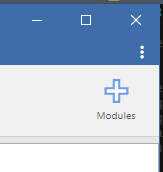
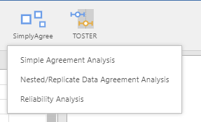
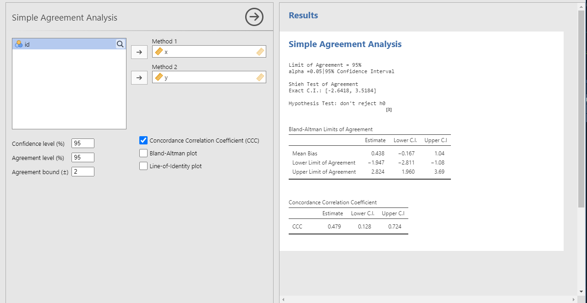
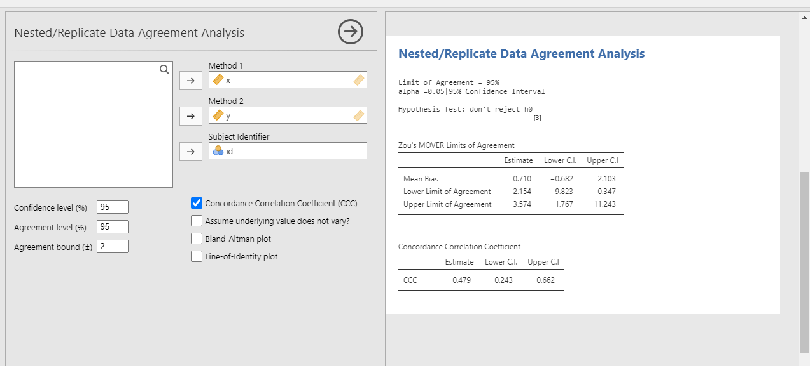
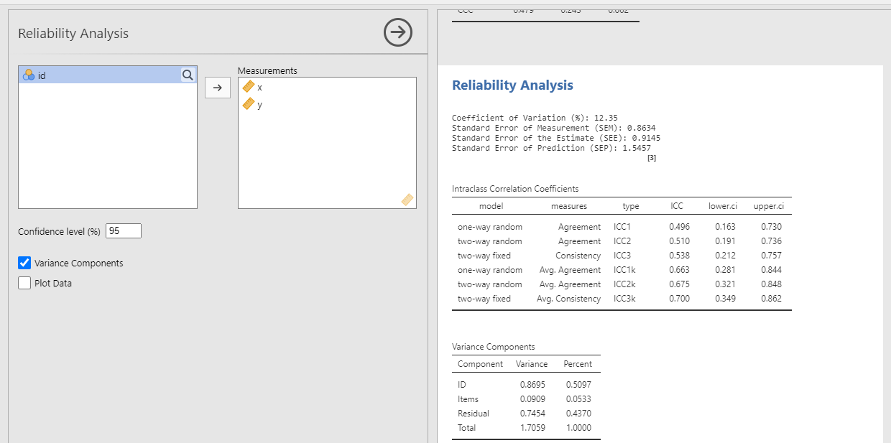

# Summary

Accurate and reliable measurements are critical to quantitative research efforts. Based on citation counts of @bland1986 and @weir2005 alone^[@bland1986 and @weir2005 have greater than 50000 and 4000 citations, respectively, at the time of writing this manuscript. Many of these publications are original research investigations.], researchers appear to highly value methods to quantify the accuracy and reliability of measurement tools used for research. This article introduces the `SimplyAgree` R package and jamovi module as user-friendly solutions for estimating agreement and reliability [@R-base; @jamovi] for continuous measurements. Updates and additional details on `SimplyAgree` can be found on the package's [website](https://aaroncaldwell.us/SimplyAgree). `SimplyAgree` was created for applied physiologists to use when evaluating different physiological measurements (e.g, comparing the measurement of oxygen consumption between two competing gas analyzers). However, the functions within `SimplyAgree` can be utilized by any researcher wanting to evaluate agreement between two continuous measurements, or for evaluating the reliability of a continuous measure^[Discrete and categorical measurements are not supported at the time of writing this manuscript].

# Statement of Need

A number of new methods have been developed in the past three decades to improve the calculation of the limits of agreement [@shieh2019;  @lin1989; @zou2011] and other measures of measurement reliability [@weir2005; @carrasco2013]. However, to author's best knowledge, statistical software &mdash; particularly open source software &mdash; to implement these statistical analyses are lacking. While some software may provide the limits of agreement analysis outlined by Bland & Altman [-@bland1986; -@bland1999], few, if any, account for multiple observations within the same research subject [@zou2011] or include hypothesis tests of agreement [@shieh2019]. `blandr` [@blandr] and `BlandAltmanLeh` [@BlandAltmanLeh] exist to aid the creation of Bland-Altman type plots, but do not offer the tests detailed by @shieh2019 or @zou2011. `MethComp` [@MethComp] is the most comprehensive with regards to limits of agreement but also lacks the methods outlined by @shieh2019. The `cccrm` package [@carrasco2013] does already provide concordance correlation coefficients as output, and is the basis of the concordance calculations within `SimplyAgree`. Lastly, `psych` [@psych] and `ICC` [@ICC] provide some measures of reliability but lack the ability to calculate standard error of the measurement. Moreover, only `blandr` has a jamovi module but the capabilities are limited to just the traditional Bland-Altman limits. 

`SimplyAgree` is also created to be easy to use for those with limited programming experience. The output from the functions is intentionally verbose and typically provides more than 1 measure of agreement or reliability. The hope is that researchers who use these functions will not limit their interpretations of the results to 1 numeric value, but instead look at the totality of the results (estimates and confidence intervals) for their interpretation. 

Additionally, many researchers may not have the skills necessary to write the code, from scratch, in order to implement many of the newest techniques. @jamovi is a open source statistical platform that provides a graphical user interface (GUI), and therefore is an accessible source for researchers, or even students, without coding experience. Therefore, a jamovi module of `SimplyAgree` was also created in order to reach those researchers who may not have the coding expertise required to effectively use the R package.

# Current R Capabilities

The R package `SimplyAgree`, currently v0.0.2 on the comprehensive R archive network (CRAN), implements a number of useful agreement and reliability analyses.

The current release of the R package can be downloaded directly from CRAN in R:

```
install.packages("SimplyAgree")
```

Or, the developmental version, can be downloaded from GitHub:

```
devtools::install_github("arcaldwell49/SimplyAgree")
```
There are 2 vignettes that document the major functions within the package that can be found on the package's website (https://aaroncaldwell.us/SimplyAgree). Overall, there are 6 fundamental functions, all with generic `plot` and `print` methods, within the R package:

1. `agree_test`: Simple Test of Agreement. This is function performs agreement analyses on two vectors of the same length, and is designed for analyses that were described by Bland & Altman [-@bland1986; -@bland1999]. In addition to providing the traditional Bland-Altman limits of agreement, the function provides a hypothesis test [@shieh2019], and provides the concordance correlation coefficient [@lin1989].

2. `agree_reps`: Test of Agreement for Replicate Data. This function provides the limits of agreement described by @zou2011 for data where the mean, per subject, does not vary. In addition, the concordance correlation coefficient, calculated by U-statistics, is also provided in the output [@carrasco2013].

3. `agree_nest`: Test of Agreement for Nested Data. This function provides the limits of agreement described by @zou2011 for data where the mean, per subject, *does* vary. Similar to the replicate data function, the concordance correlation coefficient, calculated by U-statistics, is provided in the output [@carrasco2013].

4. `loa_mixed`: Bootstrapped Limits of Agreement for Nested Data. This function calculates limits of agreement using a non-parametric bootstrap method, and can allow the underlying mean to vary (replicate data) or not (nested data).

5. `blandPowerCurve`: Power Analysis for Bland-Altman Limits of Agreement. This function implements the formula outlined by @lu2016. This allows for power calculations for the @bland1999 limits of agreement. The function `find_n` can then be used to find the sample size at which adequate power (defined by the user) is achieved.

6. `reli_stats`: Reliability Statistics. This function calculates and provides as output the statistics outlined by @weir2005. This includes an array of intraclass correlation coefficients, the coefficient of variation, and the standard error of measurement.


# Current jamovi Capabilities

The jamovi module can be added to the jamovi directly from the "add module" tab in the GUI.



The `SimplyAgree` module is then available on the main menu, and within it there are three analysis options.



The three analysis options essentially enable jamovi users to complete some of the same analyses available in the R package.

1. The simple agreement analysis incorporates the `agree_test` function. Users have the option of including the concordance correlation coefficient, and plots of the data.



2. The nested/replicate agreement analysis uses the `agree_nest` and `agree_reps` function to perform the analyses. The `agree_reps` function is used if "Assume underlying value does not vary?" is selected; otherwise `agree_nest` is used.




3. The reliability analysis utilizes `reli_stats` to calculate reliability statistics.




# Acknowledgements

I would like the thank Ashley Akerman for his kind feedback during the development of `SimplyAgree`. 

The opinions or assertions contained herein are the private views of the author and are not to be construed as official or reflecting the views of the Army or the Department of Defense. Any citations of commercial organizations and trade names in this report do not constitute an official Department of the Army endorsement of approval of the products or services of these organizations. No authors have any conflicts of interest to disclose. Approved for public release; distribution is unlimited.

# References
